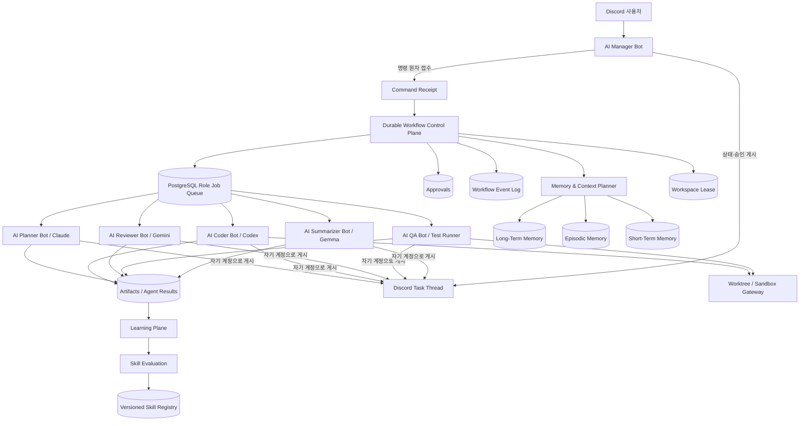
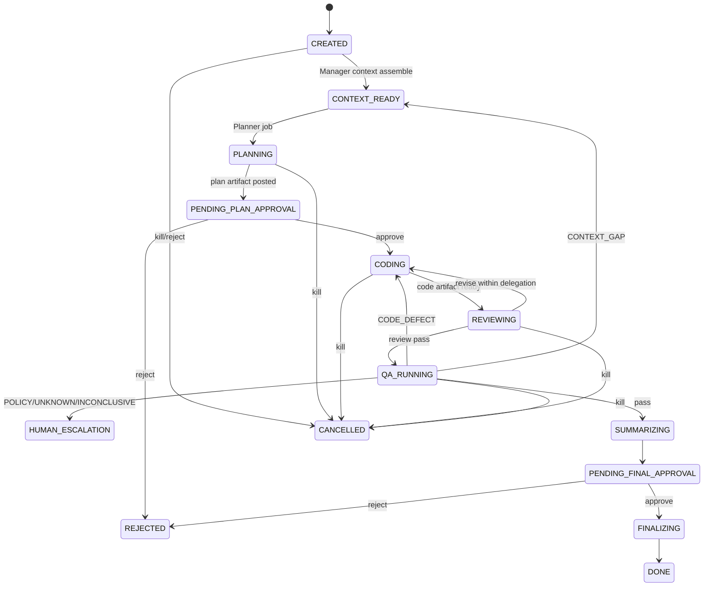
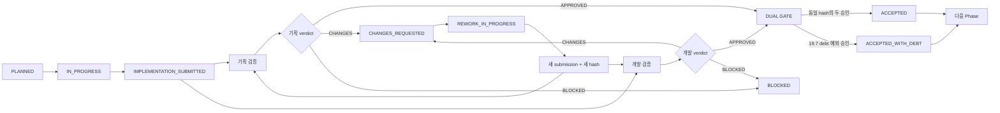

# 멀티 에이전트 Discord 봇 고도화 통합 사양서

- **문서 버전:** 1.2
- **작성일:** 2026-07-18
- **문서 상태:** Phase 실행 기준안
- **대상 시스템:** Discord 기반 AI Manager / 멀티 에이전트 오케스트레이션 플랫폼
- **기준 구현:** AI Manager 기존 Phase 1~14 구현 결과. 기존 Phase 1~7 핵심 파이프라인과 Phase 8~14 pause/kill, 멀티 매니저 하네스, DB workspace lock, stress/readiness 결과를 포함한다.
- **핵심 목표:** 역할별 Discord 봇, DB 기반 제어 채널, 원자적 작업 소유권, 장애 복구, 계층형 메모리, 검증 가능한 자가 개선 루프, Phase별 작업자 구현과 기획·개발 이중 검증 게이트를 하나의 운영 아키텍처로 통합한다.
- **이번 개정:** 기존 Phase 번호 충돌을 제거하고 신규 고도화를 Phase 15~20으로 재편한다. Phase 15에서 Delivery Governance를 먼저 부트스트랩하고, Phase 16에서 workspace 격리를 선행한 뒤 Phase 17에서 쓰기 가능한 역할 봇을 활성화한다. transaction boundary, outbox, canonical hash, validation attempt, actor 분리 규칙을 구현 계약으로 추가한다.
- **파일명 호환성:** 기존 문서 링크를 깨지 않기 위해 파일명은 `v1.1`을 유지하되, 본문 규범 버전은 1.2로 관리한다.

### 개정 이력

| 버전 | 변경 내용 |
|---|---|
| 1.0 | 6개 역할 Discord 봇, durable queue, memory, tool gateway, skill/consensus 통합 사양 |
| 1.1 | Phase별 작업자 구현, 기획·개발 이중 검증, submission hash gate, rework·재검증·인수 기준 추가 |
| 1.2 | 기존 Phase 8~14와의 번호 충돌 해소, Phase 15 Governance Bootstrap 추가, 격리 선행 순서, inbox/outbox·상태 불변식·canonical hash·validation attempt 계약 추가 |

---

## 1. 문서 목적

현재 시스템은 Claude, Codex, Gemini/Antigravity, Gemma/Ollama를 하나의 Discord 봇 뒤에서 순차 호출하는 초기 멀티 에이전트 구조를 갖고 있다. 기존 구현에는 PostgreSQL 상태머신, 승인, 워크스페이스 직렬화 큐, Skill Registry, rolling summary, Planner/Coder/Reviewer/QA 모듈이 존재한다.

이번 고도화는 다음 세 축을 동시에 달성하는 것을 목적으로 한다.

1. **실행 구조 고도화**  
   하나의 Discord 봇에 숨겨져 있던 역할을 6개의 실제 Discord 봇으로 분리하고, 역할별 작업 소유권·원자적 claim·중복 방지·장애 복구를 DB에서 강제한다.

2. **지능 구조 고도화**  
   단순한 컨텍스트 참조와 에러 재시도를 넘어, 계층형 메모리, 정적·동적 검증, 원인 분석 기반 재시도, 역할 간 합의, 검증된 스킬의 생성·평가·승격·롤백 루프를 구축한다.

3. **개발 수행·검증 체계 고도화**  
   Phase 15 이후의 모든 구현은 작업자(개발자)가 제출한 immutable 산출물을 기준으로 기획 검증과 개발 검증을 분리 수행한다. 두 검증자는 작업자와 분리되며, 동일한 제출 hash에 대해 모두 승인해야만 해당 Phase를 완료한다. Phase 15 자체는 19.12의 bootstrap 절차로 인수하며 Phase 16부터 self-hosted Gate를 의무 적용한다.

이 문서의 핵심 원칙은 다음과 같다.

> 에이전트가 스스로 권한을 확장하는 시스템이 아니라, 승인된 범위와 검증된 증거 안에서 계획·실행·검증·개선하는 시스템을 구축한다. 작업자는 자신의 구현을 스스로 최종 승인할 수 없으며, 기획 적합성과 개발 품질은 별도 검증 결과로 남긴다.

---

## 2. 현황 및 전제

### 2.1 현재 구현 상태

현재 기존 Phase 1~14를 통해 다음 기반이 구현되어 있다. 여기서 기존 Phase 번호는 본 문서가 새로 정의하는 Phase 15~20과 구분한다.

| 영역 | 현재 기반 |
|---|---|
| Discord | `bot.js` 기반 명령 접수 및 상태 메시지 |
| DB | `tasks`, `messages`, `approvals`, `agent_results`, `command_logs`, `skills` 등 |
| 승인 | PostgreSQL 원자적 승인·반려 처리 |
| 큐 | 단일 프로세스 FIFO 기반 워크스페이스 직렬화 |
| 보안 | `pathGuard`, `commandGuard`, `spawn(shell:false)` |
| 에이전트 | Planner(Claude), Coder(Codex), Reviewer(Gemini), QA, Summarizer(Gemma) |
| 스킬 | Skill Registry, 자동 Skill Proposal |
| 컨텍스트 | 최근 메시지 + rolling summary + Skill Prompt |
| QA | 테스트 자동 감지, 실패 분류, Codex 재수정 루프 |
| 운영 제어 | pause/resume, PID·process group 기반 kill, watchdog 경고 |
| 멀티 인스턴스 | 동일 Manager 코드의 `bot-a`/`bot-b` 실행 하네스 |
| 전역 잠금 | PostgreSQL 기반 workspace lock, heartbeat, TTL takeover |
| 검증 도구 | workspace lock stress harness, static/live DB readiness 검사 |

현재 멀티봇 하네스는 역할별 봇 구현이 아니라 동일 Manager의 경쟁 조건을 재현하는 도구다. 현재 queue는 프로세스 로컬 FIFO이고, `tasks.status` 중심 상태머신을 사용한다. 따라서 본 고도화는 현재 구현을 폐기하는 일괄 재작성보다 compatibility와 shadow mode를 유지하는 단계적 전환으로 수행한다.

### 2.2 bot-a, bot-b의 정확한 정의

기존 `bot-a`, `bot-b`는 서로 다른 AI 직군이 아니다. 동일한 Manager 코드를 복제 실행하여 다음을 검증하기 위한 **멀티 매니저 인스턴스**다.

- 동시 명령 수신
- 중복 처리 방지
- 승인 경쟁 조건
- workspace lock
- 프로세스 장애 복구

따라서 `bot-a`, `bot-b`를 Planner, Coder 등의 역할 봇으로 간주해서는 안 된다.

권장 명칭은 다음과 같다.

| 기존 명칭 | 권장 명칭 | 용도 |
|---|---|---|
| bot-a | `manager-primary` | 기본 Manager 인스턴스 |
| bot-b | `manager-secondary` | 동시성·장애조치·lock 테스트용 선택 인스턴스 |

기본 사용자 노출 구성은 Manager 1개를 포함한 총 6개 봇이며, `manager-secondary`는 필수 사용자 노출 봇 수에 포함하지 않는다.

### 2.3 고도화 시 보존해야 할 기존 원칙

- 승인 없는 워크스페이스 변경 금지
- 동일 워크스페이스에 대한 쓰기 작업 직렬화
- DB를 작업 상태의 단일 진실 소스로 사용
- 명령·경로 allowlist/blocklist 유지
- 실패를 예외만으로 처리하지 않고 정상 상태 분기로 기록
- `pause`, `resume`, `kill`, watchdog, 승인·반려 흐름 유지
- Phase별 작업자와 검증자 책임 분리
- 기획 검증과 개발 검증의 독립 수행 및 이중 승인
- 구현 산출물이 변경되면 기존 Phase 검증을 자동 무효화

---

## 3. 범위

### 3.1 포함 범위

- 6개의 실제 Discord 봇 계정 연결
- Manager 단일 명령 접수 구조
- 역할별 PostgreSQL 작업 큐
- 역할·인스턴스 단위 원자적 claim
- 작업 lease, heartbeat, timeout, retry, recovery
- 역할별 Discord 메시지 게시
- task thread 기반 결과 추적
- workspace lock 및 작업별 worktree 격리
- 승인 artifact hash 결합
- 계층형 메모리
- 역할별 컨텍스트 패키지
- 정적·동적 검증과 원인 분석 기반 재시도
- Skill 버전·평가·shadow·canary·rollback
- DB 및 외부 Tool Gateway
- 조건부 분기와 역할 합의
- 자동화 통합 테스트 및 실제 Discord smoke test 절차
- Phase별 작업자 구현·제출·재작업 흐름
- 기획 검증자와 개발 검증자의 독립 검증 및 이중 승인 게이트
- Phase 제출물 hash, 검증 결과, finding, 재검증 이력의 영속 저장

### 3.2 제외 범위

- 모델 자체 fine-tuning
- Discord 메시지를 봇 간 제어 프로토콜로 사용하는 구조
- 에이전트가 운영 권한을 자동 확대하는 기능
- 검증 없이 Skill을 자동 활성화하는 기능
- 운영 DB에 대한 무제한 쓰기 권한
- 모든 업무를 무조건 전원 합의로 처리하는 구조
- 작업자가 자신의 Phase 구현을 최종 검증·승인하는 구조
- 기획 검증과 개발 검증을 하나의 포괄적 리뷰 결과로 합치는 구조

---

## 4. 규범 용어

이 문서에서 다음 표현을 사용한다.

- **MUST:** 구현 완료 조건에 포함되는 필수 요구사항
- **SHOULD:** 운영 안정성을 위해 권장되는 요구사항
- **MAY:** 환경과 정책에 따라 선택 가능한 요구사항

---

## 5. 목표 사용자 노출 봇 구성

### 5.1 기본 6개 봇

| 사용자 노출명 | 내부 ID | BOT_ROLE | 실행 엔진 | 기본 명령 | 주요 책임 |
|---|---|---|---|---|---|
| AI Manager | `manager-primary` | `manager` | Orchestrator | `!manager`, `!task`, `!autotask` | 접수, 상태, 승인, 큐 등록, 전이, 운영 제어 |
| AI Planner | `pm-claude` | `planner` | Claude | `!pm` | 요구사항 분석, 계획, 리스크·의존성 정리 |
| AI Coder | `coder-codex` | `coder` | Codex | `!coder` | 승인된 범위의 구현·수정 |
| AI Reviewer | `reviewer-gemini` | `reviewer` | Gemini/Antigravity | `!reviewer` | 코드·설계 리뷰, 수정 요청, 위험 판정 |
| AI QA | `qa-runner` | `qa` | Test Runner, 분석 시 Codex | `!qa` | 정적·동적 검증, 테스트, 실패 분류 |
| AI Summarizer | `summarizer-gemma` | `summarizer` | Gemma/Ollama | `!summary` | 최종 결과·결정·검증 근거 요약 |

### 5.2 역할과 인스턴스의 구분

- `BOT_ROLE`은 역할 종류다. 예: `planner`, `coder`.
- `BOT_INSTANCE_ID`는 실행 프로세스의 고유 식별자다. 예: `pm-claude-01`.
- 동일 역할을 여러 인스턴스로 수평 확장할 수 있다.
- 기본 구성에서는 역할별 1개 인스턴스를 사용한다.
- `manager-primary`, `manager-secondary`는 같은 `BOT_ROLE=manager`를 갖지만 서로 다른 `BOT_INSTANCE_ID`를 가져야 한다.

### 5.3 역할 분리의 완료 조건

다음은 역할 분리로 인정하지 않는다.

- `.env`만 바꾸고 기존 `bot.js`를 6번 실행
- 모든 봇이 모든 Discord 명령을 직접 파싱
- 모든 봇이 동일한 작업을 claim할 수 있음
- 역할 확인을 애플리케이션의 단순 `if` 문에만 의존
- 작업 상태를 프로세스 메모리에만 보관

역할 분리로 인정되려면 최소한 다음이 강제되어야 한다.

- Manager-only 명령 ingress
- DB의 `target_role` 기반 작업 소유권
- 원자적 claim
- 역할별 capability 정책
- 역할별 Discord 계정으로 결과 게시
- lease·heartbeat·retry 기반 장애 복구
- 중복 명령·중복 결과 방지

### 5.4 런타임 역할과 Phase 수행 역할의 구분

6개 Discord 봇은 운영 중 task를 수행하는 **런타임 역할**이다. 반면 Phase 15~20을 실제로 개발하고 인수하는 과정에는 별도의 **개발 수행 역할**이 적용된다. 두 체계를 혼동하지 않는다.

| 개발 수행 역할 | 런타임 봇 활용 | 책임 | 최종 권한 |
|---|---|---|---|
| 작업자(개발자) | AI Coder 중심 | Phase 구현, 테스트, 제출 패키지 작성, 재작업 | 자신의 구현을 제출할 수 있으나 승인할 수 없음 |
| 기획 검증자 | AI Planner 보조 | 요구사항·범위·수용 기준·운영 시나리오 검증 | `PLANNING_APPROVED` 또는 변경 요청 |
| 개발 검증자 | AI Reviewer + AI QA 보조 | 코드·아키텍처·보안·동시성·테스트·복구 검증 | `DEVELOPMENT_APPROVED` 또는 변경 요청 |
| Phase Gate 관리자 | AI Manager | 제출물 고정, 검증 job 등록, 두 결과 집계, 다음 Phase 차단·해제 | 두 검증이 모두 승인된 경우에만 Phase 완료 |

`worker_actor_id`, `planning_validator_actor_id`, `development_validator_actor_id`는 서로 달라야 한다. 자동화 에이전트가 검증 자료를 생성할 수는 있지만, 책임 주체와 검증 결과는 별도 identity로 기록한다.

---

## 6. 목표 아키텍처



### 6.1 Plane 분리

| Plane | 책임 |
|---|---|
| Control Plane | 명령 접수, 상태전이, queue, lease, 승인, retry, cancel, 합의 |
| Execution Plane | 역할별 에이전트 실행, 테스트, CLI·Tool 호출 |
| Knowledge Plane | 장기·에피소드·작업 메모리, 검색, context manifest |
| Learning Plane | Skill 후보 생성, 평가, shadow, canary, 승격, rollback |

Learning Plane은 Control Plane의 보안 정책을 직접 변경할 수 없다.

---

## 7. Discord 명령 접수와 라우팅

### 7.1 Manager-only ingress

모든 사용자 명령은 AI Manager가 한 번만 접수해야 한다.

- 역할 봇은 Discord 사용자 메시지를 직접 작업으로 해석하지 않는다.
- 역할 봇은 DB에 등록된 자신의 역할 작업만 처리한다.
- `!pm`, `!coder`, `!reviewer`, `!qa`, `!summary`도 Manager가 접수한 뒤 대상 역할 job으로 변환한다.
- 역할 봇은 결과를 자신의 Discord 계정으로 게시한다.

이를 통해 명령 접수와 결과 표현을 분리한다.

```text
사용자: !pm 결제 실패 원인을 분석해줘
    ↓
AI Manager: Discord event를 원자적으로 접수
    ↓
DB: target_role=planner 작업 생성
    ↓
AI Planner: 작업 claim 및 Claude 실행
    ↓
AI Planner: 자신의 계정으로 task thread에 결과 게시
```

### 7.2 Discord 이벤트 중복 방지

`discord_event_receipts`에 Discord 원본 메시지를 먼저 등록한다.

```sql
INSERT INTO discord_event_receipts (
  source_message_id,
  guild_id,
  channel_id,
  received_by_instance_id,
  correlation_id
)
VALUES ($1, $2, $3, $4, $5)
ON CONFLICT (source_message_id) DO NOTHING
RETURNING id;
```

- `RETURNING` 결과가 없으면 이미 다른 Manager가 처리한 이벤트다.
- task 생성과 최초 workflow 생성은 같은 DB transaction 안에서 수행한다.
- 두 Manager가 같은 이벤트를 동시에 받아도 하나의 task만 만들어져야 한다.

### 7.3 메시지 루프 방지

다음 메시지는 사용자 명령으로 처리하지 않는다.

- `message.author.bot === true`
- 등록된 6개 봇 Discord user ID의 메시지
- webhook 또는 시스템 메시지
- `origin=ROLE_OUTPUT`로 등록된 publication
- 이미 `discord_event_receipts`에 존재하는 메시지

봇 출력에 `!task`, `!approve` 등의 문자열이 포함되어도 다시 명령으로 실행되지 않아야 한다.

### 7.4 역할별 명령 정책

| 명령 | ingress | target role | 워크플로우 생성 여부 |
|---|---|---|---|
| `!task` | Manager | 전체 기본 그래프 | 예 |
| `!autotask` | Manager | 전체 위임 그래프 | 예 |
| `!pm` | Manager | planner | 단발 또는 현재 task node |
| `!coder` | Manager | coder | 승인 범위 확인 후 |
| `!reviewer` | Manager | reviewer | 단발 또는 현재 artifact 리뷰 |
| `!qa` | Manager | qa | 단발 또는 현재 artifact 검증 |
| `!summary` | Manager | summarizer | 단발 또는 현재 task 요약 |
| `!approve` | Manager | control plane | approval 해결 |
| `!reject` | Manager | control plane | 반려·취소·rollback 전이 |
| `!pause` | Manager | control plane | task control state 변경 |
| `!resume` | Manager | control plane | task 재개 |
| `!kill` | Manager | control plane | 실행 중 process group 종료 요청 |
| `!phase start/submit/rework` | Manager | coder/control plane | Phase 구현·제출·재작업 job |
| `!phase validate-plan` | Manager | planner | 기획 검증 job 또는 verdict 접수 |
| `!phase validate-dev` | Manager | reviewer/qa | 개발 검증과 QA evidence job |
| `!phase gate` | Manager | control plane | 동일 hash의 이중 승인 Gate |

역할 job의 `target_role`과 실행 인스턴스의 `BOT_ROLE`이 다르면 claim 단계에서 차단되어야 한다. Phase 검증 job은 일반 task review job과 `job_type`으로도 분리하여, Planner가 개발 검증을 claim하거나 Reviewer가 기획 검증을 claim하지 못하게 한다.

---

## 8. DB 기반 역할 작업 큐

### 8.1 핵심 원칙

- Manager만 workflow node와 역할 job을 생성한다.
- 역할 봇은 자신의 역할에 해당하는 job만 claim한다.
- claim은 PostgreSQL transaction에서 원자적으로 수행한다.
- 역할 봇이 작업 결과를 제출해도 직접 다음 상태로 전이하지 않는다.
- Manager Control Plane이 결과와 정책을 평가하고 다음 node를 생성한다.

### 8.2 `role_jobs` 주요 필드

```text
id
workflow_run_id
workflow_node_id
task_id
target_role
target_instance_id nullable
job_type
payload_json
status
priority
available_at
attempt_count
max_attempts
claimed_by_instance_id
claim_token
claimed_at
heartbeat_at
lease_expires_at
idempotency_key
correlation_id
input_artifact_id
input_artifact_hash
output_artifact_id
safe_to_retry
requires_workspace_lock
last_error_code
last_error_detail_redacted
created_at
updated_at
```

Phase 수행용 `job_type`과 대상 역할은 다음처럼 고정한다.

| job_type | target_role | 설명 |
|---|---|---|
| `PHASE_IMPLEMENT` | `coder` | 최초 Phase 구현 |
| `PHASE_REWORK` | `coder` | 검증 finding 반영 |
| `PHASE_VALIDATE_PLANNING` | `planner` | 요구사항·범위·수용 기준 검증 |
| `PHASE_VALIDATE_DEVELOPMENT` | `reviewer` | 기술 품질 최종 검증 |
| `PHASE_QA_EVIDENCE` | `qa` | 테스트·장애 주입·재현 evidence 생성 |
| `PHASE_GATE` | `manager` | 두 verdict와 hash를 원자적으로 집계 |

`target_role`뿐 아니라 `job_type`별 capability도 DB function 또는 role policy에서 함께 검사해야 한다.

### 8.3 job 상태

```text
QUEUED
  → RUNNING
  → SUCCEEDED
  → FAILED
  → RETRY_WAIT
  → CANCEL_REQUESTED
  → CANCELLED
  → TIMED_OUT
  → NEEDS_RECONCILIATION
  → DEAD_LETTER
```

### 8.4 원자적 claim

권장 claim SQL은 다음과 같다.

```sql
WITH candidate AS (
  SELECT j.id
  FROM role_jobs j
  JOIN tasks t ON t.id = j.task_id
  WHERE j.status IN ('QUEUED', 'RETRY_WAIT')
    AND j.target_role = $1
    AND (j.target_instance_id IS NULL OR j.target_instance_id = $2)
    AND j.available_at <= NOW()
    AND j.attempt_count < j.max_attempts
    AND t.control_state = 'RUNNING'
  ORDER BY j.priority DESC, j.created_at ASC
  FOR UPDATE OF j SKIP LOCKED
  LIMIT 1
)
UPDATE role_jobs AS j
SET status = 'RUNNING',
    claimed_by_instance_id = $2,
    claim_token = gen_random_uuid(),
    claimed_at = NOW(),
    heartbeat_at = NOW(),
    lease_expires_at = NOW() + $3::interval,
    attempt_count = attempt_count + 1,
    updated_at = NOW()
FROM candidate
WHERE j.id = candidate.id
RETURNING j.*;
```

필수 보장사항:

- 다른 역할은 해당 job을 claim할 수 없다.
- 같은 역할 worker 20개가 동시에 요청해도 한 worker만 반환받는다.
- `target_instance_id`가 지정된 job은 해당 인스턴스만 claim한다.
- pause 상태 task는 claim되지 않는다.
- `attempt_count >= max_attempts`인 job은 claim되지 않고 recovery transaction에서 `DEAD_LETTER` 또는 `NEEDS_RECONCILIATION`로 전환된다.
- 역할 worker의 DB 계정은 위 SQL을 직접 실행하지 않고 `claim_role_job(instance_id, lease_interval)` stored procedure만 실행한다. procedure는 호출 DB principal과 `bot_instances`에 등록된 role을 결합해 역할을 결정하고 `target_role`과 `job_type` capability를 함께 검증한다. worker가 전달한 임의 role 문자열을 신뢰하지 않는다.

### 8.5 heartbeat와 fencing

실행 중 worker는 주기적으로 다음 조건으로 lease를 연장한다.

```sql
UPDATE role_jobs
SET heartbeat_at = NOW(),
    lease_expires_at = NOW() + $4::interval,
    updated_at = NOW()
WHERE id = $1
  AND status = 'RUNNING'
  AND claimed_by_instance_id = $2
  AND claim_token = $3;
```

완료 처리도 반드시 `claim_token`을 검증한다.

```sql
UPDATE role_jobs
SET status = 'SUCCEEDED',
    output_artifact_id = $4,
    updated_at = NOW()
WHERE id = $1
  AND status = 'RUNNING'
  AND claimed_by_instance_id = $2
  AND claim_token = $3
  AND lease_expires_at > NOW();
```

lease가 만료되었거나 소유권을 잃은 오래된 worker가 나중에 완료를 기록하는 것을 차단해야 한다. 완료 UPDATE가 0 row이면 worker는 성공으로 응답하지 않고 결과 artifact를 orphan 후보로 기록한 뒤 reconciliation을 요청한다.

### 8.6 idempotency

각 job에는 unique한 `idempotency_key`가 있어야 한다.

권장 구성:

```text
<workflowRunId>:<nodeKey>:<artifactHash>:<round>
```

예:

```text
run-731:coder-implement:sha256-a81f:round-1
```

동일 node가 중복 enqueue되어도 하나의 job만 존재해야 한다.

### 8.7 필수 DB transaction API

다음 operation은 애플리케이션의 여러 SQL 호출로 흩어 구현하지 않고 stored procedure 또는 하나의 명시적 DB transaction으로 제공한다.

| operation | 같은 transaction에서 보장할 내용 |
|---|---|
| `receive_discord_command` | receipt 선점, task 생성, workflow run 생성, 최초 node/job 생성, event/outbox 기록 |
| `claim_role_job` | 역할·job capability 검사, candidate lock, attempt 증가, claim token·lease 발급, job event 기록 |
| `heartbeat_role_job` | instance·claim token·RUNNING 상태 확인, lease 연장 |
| `complete_role_job` | claim token·lease·input hash 확인, output artifact 연결, job/node 완료, workflow event와 다음 node용 outbox 기록 |
| `fail_role_job` | failure class·retry budget·side effect를 평가해 RETRY_WAIT, NEEDS_RECONCILIATION, DEAD_LETTER 중 하나로 전이 |
| `request_task_control` | pause/resume/cancel expected state 검사, task version 증가, control event 기록 |
| `finalize_candidate` | approval hash, base/candidate SHA, workspace fencing token 확인, finalization event 선점 |
| `gate_delivery_phase` | 최신 submission lock, 두 validation과 hash, finding, dependency를 검사하고 ACCEPTED 전이·gate event 기록 |

외부 LLM, Discord, Git, CLI 호출은 DB transaction 안에서 실행하지 않는다. transaction은 외부 작업을 지시하는 outbox row까지만 생성하고, dispatcher가 외부 호출을 수행한 뒤 결과를 별도 idempotent transaction으로 반영한다.

### 8.8 retry와 side effect 계약

- `safe_to_retry=true`는 해당 attempt가 외부 side effect를 만들지 않았거나 side effect가 idempotency key로 재실행 가능한 경우에만 설정한다.
- Coder가 파일을 수정했거나 Tool의 실제 side effect가 불명확하면 watchdog이 임의로 재queue하지 않고 `NEEDS_RECONCILIATION`로 보낸다.
- 동일 failure fingerprint가 정책 상한에 도달하면 `DEAD_LETTER`로 전환하고 새 attempt는 사람 승인 후 새 idempotency key로 생성한다.
- retry budget은 attempt 수뿐 아니라 누적 duration, cost, changed artifact 수를 함께 검사한다.

---

## 9. Durable Workflow와 상태머신

### 9.1 task 상태와 node 상태 분리

병렬 역할과 조건부 분기를 지원하기 위해 `tasks.status` 하나에 모든 상태를 넣지 않는다.

- `tasks.lifecycle_status`: task 전체 진행 상태
- `tasks.control_state`: RUNNING, PAUSED, CANCEL_REQUESTED
- `workflow_nodes.status`: 역할별 node 상태
- `role_jobs.status`: 실제 실행 attempt 상태

여기서 설명하는 `tasks/workflow_nodes/role_jobs`는 사용자 업무의 런타임 상태다. Phase 15~20 구현 진척과 이중 검증은 별도의 `delivery_phases/phase_submissions/phase_validations` 상태로 관리하며, 두 상태머신을 하나의 status 컬럼에 섞지 않는다.

### 9.2 기본 6역할 E2E 그래프



### 9.3 strict와 autotask

#### `!task`

- 계획 승인 후 Coder 실행
- 승인 범위를 벗어나는 모든 수정은 새 승인 필요
- 최종 commit/merge 전 반드시 사람 승인

#### `!autotask`

최초 승인 시 제한적 위임 범위를 함께 저장한다.

```json
{
  "baseCommit": "abc123",
  "allowedPaths": ["src/payment/**", "test/payment/**"],
  "allowedTools": ["codex", "eslint", "npm-test"],
  "maxRevisionRounds": 2,
  "maxChangedFiles": 8,
  "maxDiffLines": 300,
  "maxDurationMinutes": 30,
  "maxCostBudget": 10,
  "expiresAt": "2026-07-18T12:00:00Z"
}
```

위임 범위를 벗어나면 자동 루프를 중단하고 새 approval을 연다.

### 9.4 승인 artifact 결합

approval은 추상적 action만 승인해서는 안 된다.

```text
approval_id
task_id
workflow_node_id
action
artifact_id
artifact_hash
context_manifest_hash
base_commit_sha
candidate_commit_sha
delegation_scope
expected_task_state
requested_by
approved_by
expires_at
```

실행 전 확인사항:

- 현재 artifact hash가 승인 당시와 동일
- 현재 base HEAD가 승인 당시와 동일
- approval이 아직 PENDING
- expected state와 실제 state가 동일
- approval scope가 실행 요청 범위를 포함

artifact가 수정되면 기존 approval과 역할 투표는 자동 무효화해야 한다.

### 9.5 상태 전이 불변식

모든 상태 변경은 `expected_status`와 `row_version`을 검사하는 compare-and-set 방식으로 수행한다. 허용 전이표는 코드와 DB migration에서 같은 version으로 관리하며 다음 불변식을 지켜야 한다.

- terminal 상태인 `DONE`, `REJECTED`, `CANCELLED`는 별도 관리자 recovery operation 없이 비terminal 상태로 돌아가지 않는다.
- `workflow_nodes` 완료와 그 node의 최종 artifact 연결은 같은 transaction에서 기록한다.
- 다음 node/job 생성과 현재 node 완료 사이에는 unique idempotency key가 존재한다.
- 모든 상태 변경은 append-only `workflow_events`를 남기며 event에는 before/after status, actor, reason, input/output hash가 포함된다.
- Manager가 여러 개 실행되어도 scheduler는 DB row lock, advisory lock 또는 동일 효과의 idempotent transaction으로 한 번만 전이를 확정한다.
- projection 상태와 event log가 불일치하면 자동 진행하지 않고 `NEEDS_RECONCILIATION`로 보낸다.

상태 enum, 허용 전이, terminal 여부, retry 가능 여부는 테스트가 읽을 수 있는 versioned definition으로 제공한다. Mermaid diagram만 상태머신의 유일한 정의로 사용하지 않는다.

---

## 10. 역할별 책임과 capability

### 10.1 Manager

**허용:**

- Discord 명령 접수
- task/thread 생성
- workflow 전이
- 역할 job 등록
- 승인·반려 처리
- pause/resume/kill
- 상태·health 집계
- 최종 승인 후 안전한 finalizer 호출
- Phase 제출물 고정 및 기획·개발 검증 job 동시 등록
- 동일 submission hash에 대한 두 검증 결과 집계
- 두 검증 승인 전 다음 Phase 진입 차단

**금지:**

- LLM 판단만으로 역할 결과를 임의 변경
- 승인 없이 Coder 작업 생성
- 역할 bot을 Discord 메시지로 제어
- token 또는 원문 secret 출력

### 10.2 Planner

**허용:**

- 읽기 전용 컨텍스트 조회
- 요구사항 분석
- 계획·리스크·수용 기준 생성
- 관련 Tool의 dry-run 조회

**금지:**

- 소스 파일 수정
- commit/push
- 운영 DB 쓰기
- Coder job 직접 생성
- Phase 기획 검증 중 구현 파일 수정
- 작업자 또는 개발 검증자의 verdict 대리 작성

### 10.3 Coder

**허용:**

- 승인된 task worktree의 허용 경로 수정
- 승인된 CLI·Tool 사용
- diff·candidate commit artifact 생성

**금지:**

- canonical workspace 직접 수정
- 승인 범위 밖 경로 수정
- 최종 merge/push
- 다른 역할의 job claim
- 자신의 Phase 제출물에 대한 기획·개발 최종 승인

### 10.4 Reviewer

**허용:**

- diff, plan, requirement, test evidence 읽기
- structured verdict 생성
- blocking issue·수정 가이드 생성

**금지:**

- 코드 직접 수정
- 승인 상태 변경
- Coder를 직접 호출
- Phase 개발 검증 중 코드를 직접 수정
- 기획 검증 verdict를 덮어쓰기

### 10.5 QA

**허용:**

- 정적 분석, lint, unit/integration test
- sandbox에서 동적 검증
- 실패 fingerprint와 root cause 생성
- Codex를 분석 전용으로 보조 호출

**금지:**

- QA bot 자체가 코드 수정
- 테스트 미실행을 PASS로 기록
- 정책 차단·환경 오류를 코드 결함으로 오분류

코드 수정이 필요하면 Manager가 별도의 Coder job을 생성한다. Phase 개발 검증에서는 QA가 재현 로그와 테스트 evidence를 생성하고, 개발 검증자는 이를 포함해 별도 verdict를 확정한다.

### 10.6 Summarizer

**허용:**

- 최종 artifact와 event를 읽어 요약
- 결정, 변경, 검증, 미해결 위험을 구조화
- episodic memory candidate 생성

**금지:**

- task 상태 변경
- 코드·승인 수정
- 민감정보 원문 포함

---

## 11. Discord task thread 출력 모델

### 11.1 thread 생성

- Manager가 task 접수 시 전용 thread를 생성한다.
- `tasks.discord_thread_id`에 thread ID를 저장한다.
- 모든 역할 결과는 해당 thread에 게시한다.
- 역할 결과는 반드시 역할 Discord 봇 계정으로 게시한다.

### 11.2 공통 메타데이터

모든 DB message, artifact, Discord publication에는 다음이 포함되어야 한다.

```text
taskId
role
agent
botInstanceId
correlationId
workflowRunId
workflowNodeId
artifactId 또는 resultId
```

Discord embed footer 예시:

```text
task#731 · role=reviewer · agent=gemini · corr=01J2... · artifact=art-442
```

### 11.3 역할별 표시 예시

```text
AI Manager
작업 #731 접수 완료. Planner 작업을 등록했습니다.

AI Planner
계획 수립 완료. 변경 대상, 리스크, 수용 기준을 정리했습니다.

AI Coder
구현 완료. 변경 파일 4개, +128/-31. candidate commit: e18c...

AI Reviewer
판정: REVISE. 결제 retry 경계 조건이 누락되었습니다.

AI QA
판정: PASSED. lint 0건, unit 48/48, integration 12/12.

AI Summarizer
최종 변경·검증·잔여 위험 요약을 생성했습니다.

AI Manager
최종 artifact 승인을 요청합니다. !approve <approval-id>
```

### 11.4 Discord publication 중복 방지

`discord_publications`에 `publication_key` unique index를 둔다.

```text
publication_key = <taskId>:<workflowNodeId>:<artifactHash>:<messageType>
```

게시 절차:

1. publication row를 `PENDING`으로 선점
2. Discord 전송
3. `discord_message_id` 저장 후 `POSTED`
4. 재시작 시 message ID가 있으면 edit/reuse
5. 전송 직후 장애가 난 경우 thread에서 correlation marker를 검색해 기존 메시지를 복구

Discord API 호출 자체의 exactly-once 보장은 어렵기 때문에, DB 선점과 correlation marker로 실질적인 중복을 억제한다.

### 11.5 Transactional Outbox와 reconciliation

Discord 게시 요청은 workflow/node 상태 변경과 같은 transaction에서 `discord_publications` 또는 공통 `outbox_events`에 기록한다. Discord API는 transaction 밖의 publisher가 호출한다.

- outbox row는 `PENDING → DISPATCHING → POSTED` 또는 `RETRY_WAIT/DEAD_LETTER`로 전이한다.
- dispatcher claim에도 lease와 claim token을 사용한다.
- Discord 전송 전에 machine-readable correlation marker를 embed footer 또는 허용된 hidden metadata에 포함한다.
- 전송 성공 후 DB ack 전에 장애가 발생하면 reconciler가 해당 thread의 최근 메시지를 제한된 page 범위에서 조회하여 marker와 author bot ID가 모두 일치하는 메시지를 복구한다.
- marker 검색이 불가능하거나 결과가 둘 이상이면 자동 재게시하지 않고 reconciliation 대상으로 보낸다.
- thread 생성, message 게시, edit도 각각 독립된 idempotency/publication key를 사용한다.

`workflow_events`와 outbox 사이의 dual-write를 허용하지 않는다. 둘 중 하나만 기록되는 경로는 integration test에서 차단해야 한다.

---

## 12. Bot Instance Registry와 운영 상태

### 12.1 `bot_instances`

```text
instance_id
bot_role
agent_engine
discord_user_id
discord_application_id
hostname
pid
process_version
status
started_at
last_heartbeat_at
current_job_id
cli_health_json
db_health
workspace_health_json
created_at
updated_at
```

### 12.2 heartbeat

권장 기본값은 환경 설정으로 조정한다.

| 항목 | 권장 기본값 |
|---|---:|
| bot heartbeat | 10초 |
| instance stale 판정 | 30초 |
| job lease | 60초 |
| job heartbeat | 15초 |
| graceful kill 대기 | 10초 |
| hard kill 상한 | 30초 |
| 기본 max attempts | 3회 |

### 12.3 상태

```text
STARTING
ONLINE
DEGRADED
BUSY
PAUSED
DRAINING
OFFLINE
STALE
```

---

## 13. 장애 복구, pause/resume/kill, watchdog

### 13.1 역할 봇 종료

역할 봇이 실행 중 종료되면:

1. heartbeat가 중단된다.
2. lease 만료 후 watchdog이 orphan job을 감지한다.
3. 안전하게 재시도 가능한 job이면 `RETRY_WAIT`으로 전환한다.
4. side effect 여부가 불명확하면 `NEEDS_RECONCILIATION`으로 보낸다.
5. 역할 봇 재시작 후 해당 역할 job을 다시 claim한다.

### 13.2 재시도 정책

| 유형 | 자동 재시도 |
|---|---|
| Planner/Reviewer/Summarizer LLM timeout | 가능, backoff 적용 |
| QA sandbox infra failure | 제한적 가능 |
| Coder 실행 전 종료 | 가능 |
| Coder가 파일 수정 후 결과 저장 전 종료 | reconciliation 필요 |
| Discord 게시 실패 | publication key 기반 재시도 |
| 정책 위반 | 자동 재시도 금지 |
| unknown side effect | 사람 확인 |

### 13.3 pause

- `tasks.control_state=PAUSED`
- 새로운 role job claim 중단
- 실행 중 job은 안전 지점에서 `PAUSED` 또는 `CANCEL_REQUESTED`를 확인
- 장시간 CLI는 process control channel에서 pause를 지원하지 않으면 현재 attempt 종료 후 다음 전이를 중단

### 13.4 resume

- `tasks.control_state=RUNNING`
- 실행 가능한 node를 재평가
- 중복 job이 생기지 않도록 idempotency key 확인

### 13.5 kill

1. `CANCEL_REQUESTED` 기록
2. 실행 worker에 cancel signal 전달
3. child process group에 SIGTERM
4. grace period 후 SIGKILL
5. worktree·artifact 상태 검사
6. `CANCELLED`, `KILL_FAILED`, `NEEDS_RECONCILIATION` 중 하나로 종료

### 13.6 watchdog

watchdog은 다음을 감지한다.

- stale bot instance
- expired job lease
- timeout 초과
- heartbeat 없는 workspace lease
- 과도한 retry
- 동일 failure fingerprint 반복
- queue 대기시간 상한 초과
- Discord publication stuck

---

## 14. Workspace lock과 실행 격리

### 14.1 작업별 worktree

Coder와 QA는 canonical repository를 직접 사용하지 않는다.

```text
Canonical Repository: 읽기 및 최종 통합 전용
        ↓
Task-specific Git Worktree
        ↓
Sandbox / Container
        ↓
Coder / QA 실행
        ↓
Candidate Commit + Diff Artifact
        ↓
최종 승인
        ↓
Manager Finalizer가 정확한 commit만 통합
```

### 14.2 workspace lease

`READ_SHARED` 복수 소유자와 exclusive lease를 함께 표현하기 위해 workspace당 단일 row만 두지 않는다. 최소 논리 모델은 다음과 같다.

```text
workspace_lock_heads
  workspace_id primary key
  current_fencing_token
  updated_at

workspace_leases
  lease_id primary key
  workspace_id
  lease_owner_instance_id
  lease_owner_task_id nullable
  lease_owner_operation_id
  lease_owner_job_id nullable
  fencing_token
  acquired_at
  heartbeat_at
  expires_at
  released_at
  mode
```

모드:

- `READ_SHARED`
- `WRITE_EXCLUSIVE`
- `FINALIZE_EXCLUSIVE`

획득 procedure는 `workspace_lock_heads`를 `FOR UPDATE`로 잠근 상태에서 만료되지 않은 holder를 검사한다. `READ_SHARED`는 다른 `READ_SHARED`와만 공존할 수 있고, 두 exclusive mode는 어떤 활성 holder와도 공존할 수 없다. exclusive 획득 때 `current_fencing_token`을 증가시켜 새 token을 발급한다.

### 14.3 두 Manager 동시 실행

- 동일 Discord event는 command receipt unique index로 1회 처리
- 동일 workflow node는 idempotency key로 1회 enqueue
- 동일 workspace finalization은 `FINALIZE_EXCLUSIVE` lease로 1회 실행
- lease 획득 시 fencing token 증가
- 최종 통합 전 HEAD와 approved artifact hash를 재검증
- finalizer는 전달받은 fencing token이 현재 head token과 같고 lease가 만료되지 않았는지 DB에서 즉시 재검증한 뒤에만 ref를 갱신
- canonical repository는 일반 Coder/QA container에 read-only로 mount하고, ref 갱신 권한은 finalizer 전용 credential에만 부여

### 14.4 QA 격리

`npm test`, `mvn test` 등의 테스트는 임의 코드 실행으로 취급한다.

- 폐기 가능한 worktree 또는 container에서 실행
- CPU, memory, process, timeout 제한
- 네트워크 기본 차단 또는 allowlist
- 출력 크기 제한
- 프로젝트 밖 쓰기 차단
- 운영 credential 미주입

Git worktree가 canonical repository의 `.git` metadata를 공유하는 환경에서는 sandbox가 해당 metadata에 직접 접근하지 못하게 한다. 강한 격리가 어려우면 task별 disposable clone 또는 별도 bare mirror를 사용한다.

---

## 15. 계층형 메모리 시스템

### 15.1 Long-Term Memory

대상:

- 4년 치 회의록
- 기획서
- Figma 문서와 디자인 시스템
- GitHub 코드·이슈·PR
- 아키텍처 가이드
- 회사 도메인 지식
- 인프라 접근 정책

필수 메타데이터:

```text
source_system
source_document_id
source_version
content_hash
valid_from
valid_to
superseded_by
project
department
security_classification
allowed_roles
trust_level
```

### 15.2 Episodic Memory

저장 대상:

- 유사 작업의 성공·실패 이력
- 사용 Skill version
- 실패 fingerprint
- 수정 과정
- 사람 피드백
- 최종 결과와 운영 성과

분류:

```text
SUCCESSFUL_PATTERN
FAILED_PATTERN
ANTI_PATTERN
INCONCLUSIVE
```

검증되지 않은 작업은 성공 few-shot으로 사용하지 않는다.

### 15.3 Short-Term Memory

현재 task에 한정해 다음을 저장한다.

- 목표
- 제약
- 확정 결정
- 미결정 사항
- node별 결과
- artifact 버전
- 역할별 이견
- 도구 실행 결과
- 남은 비용·시간·retry 예산

Discord 대화는 표시 채널이며, 제어 상태는 DB에 저장한다.

### 15.4 역할별 Context Manifest

모든 역할 job은 동일한 전체 컨텍스트 대신 역할별 context package를 받는다.

```json
{
  "taskId": 731,
  "workflowNodeId": "node-review-2",
  "role": "reviewer",
  "contextItems": [
    {
      "memoryId": "mem-91",
      "sourceVersion": "v14",
      "contentHash": "sha256:...",
      "reason": "current API authentication policy",
      "trustLevel": "canonical",
      "tokenCount": 820
    }
  ],
  "totalTokens": 6240,
  "manifestHash": "sha256-..."
}
```

Context Manifest hash는 approval, vote, agent result와 연결한다.

재현 가능성을 위해 manifest는 source ID/version만 참조하지 않고 역할에 실제 전달된 chunk의 `contentHash`, ACL policy version, retrieval query version, rank score와 truncation 여부를 포함한다. 원본이 갱신되어도 과거 manifest가 가리키던 content-addressed snapshot은 retention 정책 범위에서 재현 가능해야 한다.

### 15.5 Retrieval 순서

```text
사용자·역할 권한 필터
→ task 질의 분해
→ Long/Episodic/Short 병렬 검색
→ keyword + vector hybrid retrieval
→ 시점·출처·신뢰도 rerank
→ 중복·충돌 탐지
→ 역할별 token budget 적용
→ Context Manifest 생성
```

회의록·Figma 코멘트·GitHub 이슈의 문장은 데이터로 취급하며 시스템 명령으로 승격하지 않는다.

---

## 16. 스킬 피드백 및 자가 개선 루프

### 16.1 Skill lifecycle

```text
DRAFT
  → GENERATED
  → STATIC_VALIDATED
  → SANDBOX_EVALUATED
  → SHADOW
  → CANARY
  → ACTIVE
  → DEPRECATED / ROLLED_BACK
```

### 16.2 immutable Skill version

```text
skill_id
version
parent_version
content_hash
prompt_hash
role
agent_engine
tool_permissions
permission_diff
source_task_ids
evaluation_dataset_version
evaluation_summary
promotion_status
created_by
activated_at
rollback_reason
```

기존 Skill 파일을 덮어쓰지 않는다.

### 16.3 정적 검증

- JSON Schema
- 필수 prompt/checklist
- allow/block 충돌
- 경로 이탈
- 민감정보
- 권한 상승
- prompt injection 패턴
- 무한 반복 규칙
- 출력 schema

### 16.4 동적 검증

- golden task
- 과거 성공 replay
- 과거 실패 regression
- adversarial case
- sandbox 통합 테스트
- 비용·지연·도구 호출 수
- 기존 활성 버전과 품질 비교

### 16.5 실패 분류

검증 에이전트는 구조화된 결과를 반환해야 한다.

```json
{
  "failureClass": "CODE_DEFECT",
  "fingerprint": "unit-test:payment:retry-limit",
  "evidenceArtifactIds": ["artifact-312"],
  "rootCause": "retry count condition is off by one",
  "recommendedTransition": "CODER_PATCH",
  "confidence": 0.93,
  "retryable": true
}
```

| 실패 유형 | 권장 전이 |
|---|---|
| `CODE_DEFECT` | Coder 수정 |
| `REQUIREMENT_MISMATCH` | Planner·합의 단계로 복귀 |
| `CONTEXT_GAP` | Context 재조회 |
| `CONTEXT_CONFLICT` | 사람 판단 또는 source 우선순위 확인 |
| `ENVIRONMENT_FAILURE` | 환경 복구, 코드 수정 금지 |
| `POLICY_VIOLATION` | 즉시 중단 |
| `FLAKY_TEST` | 제한적 재실행 |
| `TOOL_FAILURE` | backoff 또는 대체 Tool |
| `UNKNOWN` | 사람 이관 |

### 16.6 권한 상승 제한

다음 변경은 자동 활성화할 수 없다.

- `requiredApproval=false`
- 허용 명령 추가
- 운영 DB 쓰기
- 네트워크 목적지 확대
- 프로젝트 밖 경로 접근
- 사용자 데이터 등급 확대

보안 관리자 승인과 별도 evaluation이 필요하다.

---

## 17. 실시간 DB 조회와 Tool Gateway

### 17.1 내부 Query Agent

Query Builder와 Query Validator는 내부 subagent로 구성할 수 있다. 이들은 6개 사용자 노출 Discord 봇에 추가되지 않는다.

- Query Builder: 업무 의도에서 SQL 후보 생성
- Query Security Validator: SQL 정책·권한·PII 검증
- Cost Validator: EXPLAIN 비용·scan row 검증
- DB Gateway: deterministic 최종 차단

### 17.2 DB 조회 흐름

```text
업무 요청
→ Query Intent
→ Query Builder
→ SQL Parser / AST Validator
→ Security Validator
→ EXPLAIN Cost Validator
→ PII / Column Policy
→ DB Gateway
→ Read-only Replica
→ Result Shape Validator
→ 역할 에이전트 응답
```

### 17.3 DB에서 강제할 정책

- read-only replica
- read-only DB account
- DDL/DML 차단
- multi-statement 차단
- schema/table/column allowlist
- parameter binding
- statement timeout
- lock timeout
- 최대 row·result size
- scan cost 상한
- RLS와 masking
- 위험 함수·catalog 제한
- task/user/policy version 감사 기록

LLM 두 개가 동시에 잘못 승인해도 DB Gateway가 변경을 막아야 한다.

### 17.4 공통 Tool Invocation 계약

```text
invocation_id
task_id
workflow_node_id
role
agent
tool_name
capability_scope
policy_version
input_hash
dry_run
idempotency_key
status
output_artifact_id
declared_side_effects
actual_side_effects
rollback_token
duration_ms
cost
```

GitHub, Figma, DB, CLI, file access에 같은 정책 구조를 적용한다.

---

## 18. 조건부 분기와 역할 합의

### 18.1 독립 검토 우선

역할 합의 시 다른 역할의 의견을 먼저 보여주지 않는다. 각 역할은 동일 artifact hash를 기준으로 독립 투표한다.

```json
{
  "decision": "REVISE",
  "criteria": {
    "requirementCoverage": 0.9,
    "technicalFeasibility": 0.8,
    "designConsistency": 0.4
  },
  "blockingIssues": ["design token mismatch"],
  "evidenceArtifactIds": ["artifact-88"],
  "confidence": 0.86
}
```

### 18.2 합의 절차

1. 독립 검토
2. 의견 차이만 Aggregator가 공개
3. 최대 라운드 내 제한 토론
4. weighted quorum 또는 전문 역할 veto
5. 미해결 충돌은 사람에게 escalation

### 18.3 업무 유형별 참가자

| 작업 유형 | 필수 역할 |
|---|---|
| UI 기능 | Planner, Reviewer, QA, Design 내부 validator |
| Backend API | Planner, Coder, Reviewer, QA, Security validator |
| DB 조회 | Query Builder, Query Security, QA |
| 인프라 변경 | Planner, Coder, QA, Security, Service Owner 승인 |
| 문서 | Planner, Reviewer, Summarizer |

### 18.4 합의 무효화

artifact가 수정되면 이전 vote와 consensus는 무효화하고 새 artifact hash로 다시 수행한다.

---

## 19. Phase 단위 작업·이중 검증 운영 모델

### 19.1 적용 범위

이 절은 Phase 15~20 및 이후 고도화 Phase를 **어떻게 개발하고 인수할지**를 정의한다. 사용자 업무를 처리하는 Planner→Coder→Reviewer→QA 런타임 그래프와 별개의 개발 거버넌스다.

기본 원칙은 다음과 같다.

1. 작업자(개발자)가 Phase 단위로 구현한다.
2. 구현 완료 후 하나의 immutable 제출 패키지를 만든다.
3. 기획 검증자와 개발 검증자가 같은 제출 hash를 기준으로 서로 독립적으로 검증한다.
4. 두 검증이 모두 승인되어야 Manager가 Phase를 `ACCEPTED`로 전환한다.
5. 어느 한쪽이라도 변경을 요청하면 작업자에게 되돌아간다.
6. 제출물이 수정되면 기존 두 검증 결과는 자동으로 `STALE` 처리하고 다시 검증한다.
7. 작업자는 자신의 제출물을 최종 승인할 수 없다.
8. Phase 15는 self-hosted Gate를 만드는 bootstrap Phase다. 두 명의 분리된 validator가 외부 고정 manifest를 검증하고, Phase 16부터는 본 절의 DB Gate를 사용한다.

### 19.2 수행 역할과 책임 분리

| 역할 | 주요 책임 | 금지 사항 | 기본 Discord 표시 주체 |
|---|---|---|---|
| 작업자(개발자) | Phase 구현, migration, 테스트, 문서, 재작업, 제출 패키지 생성 | 자기 검증 승인, 제출 후 무기록 수정 | AI Coder |
| 기획 검증자 | 요구사항 충족, 범위, 사용자·운영 흐름, 수용 기준, 추적성 검증 | 코드 수정, 개발 검증 verdict 변경 | AI Planner |
| 개발 검증자 | 코드 품질, 아키텍처, 보안, 동시성, 장애 복구, 테스트·성능 검증 | 코드 직접 수정, 기획 검증 verdict 변경 | AI Reviewer |
| QA evidence 제공자 | lint/static/test/smoke/장애 주입 결과 생성 | Phase 승인 verdict 단독 확정 | AI QA |
| Phase Gate 관리자 | 제출 고정, 검증 job 생성, verdict 집계, 다음 Phase gate | 검증 결과 임의 조작 | AI Manager |

분리 규칙:

```text
worker_actor_id != planning_validator_actor_id
worker_actor_id != development_validator_actor_id
planning_validator_actor_id != development_validator_actor_id
```


모든 actor는 사람, 에이전트, 혼합 운영 여부와 관계없이 고유 identity와 권한을 가져야 한다. 단순 문자열 actor ID가 아니라 `delivery_actors` principal과 `phase_assignments`에 의해 배정하며, 검증 verdict 제출 credential은 작업자 credential과 분리한다. 동일한 사람이 긴급 예외로 두 검증을 수행해야 하는 경우에는 관리자 사유, 기간, 위험 수용자를 별도 기록하고 `ACCEPTED`로 자동 처리하지 않는다.

독립 검증의 최소 조건:

- 두 validator는 서로 다른 principal과 assignment를 사용한다.
- 다른 validator의 draft verdict를 보기 전에 자신의 evidence와 draft를 고정한다.
- 개발 검증의 필수 테스트는 작업자 로그만 재사용하지 않고 분리된 환경에서 재실행한다.
- 동일 모델을 사용하더라도 세션, context manifest, tool credential, verdict artifact를 분리한다.
- 비상 겸임은 `GOVERNANCE_EXCEPTION` event와 risk owner 승인 없이는 Gate 입력으로 사용할 수 없다.

### 19.3 Phase 상태 모델

Phase 전체 상태와 두 검증 상태를 분리한다.

```text
phase_status:
PLANNED
IN_PROGRESS
IMPLEMENTATION_SUBMITTED
VALIDATION_IN_PROGRESS
CHANGES_REQUESTED
REWORK_IN_PROGRESS
ACCEPTED
ACCEPTED_WITH_DEBT
BLOCKED
CANCELLED

planning_validation_status:
NOT_STARTED
PENDING
IN_PROGRESS
APPROVED
CHANGES_REQUESTED
BLOCKED
STALE

development_validation_status:
NOT_STARTED
PENDING
IN_PROGRESS
APPROVED
CHANGES_REQUESTED
BLOCKED
STALE

validation_attempt_status:
PENDING
IN_PROGRESS
COMPLETED
INFRA_FAILED
CANCELLED
STALE_ON_ARRIVAL
```

`planning_validation_status`와 `development_validation_status`는 최신 submission에 대한 projection이다. 개별 실행 이력은 `validation_attempt_status`로 관리하며 terminal attempt의 verdict와 evidence는 수정하지 않는다.

권장 흐름:



`VALIDATION_IN_PROGRESS`에서는 두 검증 job을 가능한 한 병렬 등록한다. 한 검증자의 초안 verdict는 다른 검증자에게 먼저 노출하지 않아 anchoring을 줄인다.

### 19.4 작업자 제출 패키지

작업자는 Phase 구현을 끝낸 뒤 다음을 하나의 제출 패키지로 고정해야 한다.

```text
phase_submission_id
phase_id
submission_round
base_commit_sha
candidate_commit_sha
artifact_bundle_hash
requirements_trace_matrix
changed_files_manifest
db_migration_manifest
rollback_plan
automated_test_results
manual_smoke_evidence
security_scan_result
known_issues
operational_notes
submitted_by
submitted_at
```

필수 산출물:

- Phase 요구사항별 구현 위치와 테스트를 연결한 trace matrix
- 전체 diff와 candidate commit SHA
- DB migration의 forward/backward 절차
- 설정·환경변수 변경 목록
- 자동화 테스트, 동시성 테스트, 장애 주입 결과
- 실제 Discord smoke test가 필요한 경우 실행 절차와 증거
- rollback 및 feature flag 계획
- 미해결 이슈와 영향 범위

제출 후 작업자가 파일을 수정하면 기존 submission을 변경하지 않고 새 round와 새 hash를 생성한다.

#### 19.4.1 canonical artifact bundle hash

`artifact_bundle_hash`는 임의 ZIP 파일이나 DB row 직렬화 결과가 아니라 versioned canonical manifest의 SHA-256으로 계산한다.

```json
{
  "schemaVersion": 1,
  "phaseId": "phase-16",
  "submissionRound": 2,
  "baseCommitSha": "abc123...",
  "candidateCommitSha": "e18c...",
  "files": [
    {"path": "src/example.js", "sha256": "...", "mode": "100644"}
  ],
  "migrationArtifacts": [{"path": "src/db/migrations/016.sql", "sha256": "..."}],
  "testEvidence": [{"id": "art-811", "sha256": "..."}],
  "requirementsTraceHash": "sha256:...",
  "rollbackPlanHash": "sha256:...",
  "knownIssuesHash": "sha256:..."
}
```

canonicalization 규칙:

- UTF-8, 고정 schema version, key 정렬이 보장되는 canonical JSON을 사용한다.
- repository 상대 경로를 POSIX 형식으로 정규화하고 path 기준으로 정렬한다.
- 파일 내용은 line ending을 임의 변환하지 않고 raw byte 기준 SHA-256을 계산한다.
- symlink는 link target과 file mode를 manifest에 구분해 기록한다.
- manifest 자체 hash는 `sha256:<lowercase hex>` 형식으로 저장한다.
- 제출 후 manifest 또는 참조 artifact 하나라도 바뀌면 같은 row를 수정하지 않고 새 submission round를 만든다.

hash 계산기는 구현체 하나를 공유하되, 개발 검증 환경에서 독립적으로 같은 결과가 나오는 golden vector test를 제공한다.

### 19.5 기획 검증

기획 검증자는 구현 방법보다 **의도와 결과의 일치**를 검증한다.

필수 확인 항목:

- Phase 목표와 포함·제외 범위 충족
- 사용자 명령, Discord 표시, 승인·반려·오류 UX 일관성
- 운영자 관점의 상태 가시성 및 복구 절차
- 완료 기준과 수용 기준의 실제 충족
- 요구사항 누락, 과잉 구현, 승인되지 않은 scope creep
- 이전 Phase와 다음 Phase의 dependency 및 호환성
- 문서, runbook, smoke test 절차의 실행 가능성
- 알려진 제한사항과 사용자 영향의 명시

구조화 결과 예시:

```json
{
  "validatorType": "PLANNING",
  "phaseId": "phase-16",
  "phaseSubmissionId": "ps-16-02",
  "validationAttempt": 1,
  "artifactBundleHash": "sha256:...",
  "verdict": "CHANGES_REQUESTED",
  "requirementsCoverage": 0.92,
  "blockingFindings": ["!team 출력에 DEGRADED 원인이 누락됨"],
  "nonBlockingFindings": ["운영 예시를 1건 추가 권장"],
  "evidenceArtifactIds": ["art-801"],
  "validatedBy": "planning-validator-01"
}
```

기획 검증자는 코드를 수정하지 않는다. 변경이 필요하면 finding을 Manager에 제출하고, Manager가 작업자에게 rework job을 생성한다.

### 19.6 개발 검증

개발 검증자는 제출된 구현이 기술적으로 안전하고 재현 가능한지를 검증한다.

필수 확인 항목:

- 코드 구조, 인터페이스, backward compatibility
- 역할별 작업 소유권과 권한 경계
- transaction, atomic claim, lease, fencing, idempotency
- workspace lock, worktree, sandbox, process termination
- migration 안전성, rollback 가능성, 데이터 정합성
- static analysis, lint, unit/integration/E2E 결과
- 동시성·장애 주입·재시작·timeout 테스트 재현
- secret redaction, token 비노출, path/command policy
- logging, metrics, audit, correlation 추적
- 성능, queue backpressure, resource limit

개발 검증자는 작업자가 제공한 로그만 신뢰하지 않고, 중요 테스트를 별도 환경에서 재실행해야 한다. AI QA는 실행 evidence를 만들고 AI Reviewer 또는 지정 개발 검증자가 최종 기술 verdict를 기록한다.

```json
{
  "validatorType": "DEVELOPMENT",
  "phaseId": "phase-16",
  "phaseSubmissionId": "ps-16-02",
  "validationAttempt": 1,
  "artifactBundleHash": "sha256:...",
  "verdict": "APPROVED",
  "checks": {
    "atomicClaim": "PASS",
    "wrongRoleClaim": "PASS",
    "crashRecovery": "PASS",
    "secretScan": "PASS"
  },
  "evidenceArtifactIds": ["art-811", "art-812"],
  "validatedBy": "development-validator-01"
}
```

개발 검증자도 검증 중 코드를 직접 수정하지 않는다. 수정이 필요하면 재현 절차, 기대 결과, 실제 결과, 영향도와 함께 작업자에게 반환한다.

같은 submission에서 validator process 또는 검증 인프라가 실패한 경우에는 기존 validation row를 덮어쓰지 않고 새 `validation_attempt`를 생성한다. terminal verdict가 기록된 attempt는 immutable이며, Gate는 각 validator type의 최신 유효 terminal attempt만 사용한다.

### 19.7 이중 승인 Gate

Manager는 다음 조건을 모두 만족할 때만 Phase를 `ACCEPTED`로 전환한다.

```text
planning verdict == APPROVED
development verdict == APPROVED
planning.artifact_bundle_hash == development.artifact_bundle_hash
planning.phase_submission_id == development.phase_submission_id
phase_submission is latest, SEALED, and immutable
planning/development validation attempts are latest valid terminal attempts
all BLOCKER/MAJOR findings are CLOSED
```

추가 규칙:

- 한쪽 승인만으로는 Phase 완료 불가
- 한쪽 `BLOCKED`는 Phase `BLOCKED`, 한쪽 `CHANGES_REQUESTED`는 Phase `CHANGES_REQUESTED`로 전환
- 두 검증자는 서로의 verdict를 수정·대리 승인할 수 없음
- Manager는 두 결과를 집계할 뿐 품질 판단을 임의로 바꾸지 않음
- 새 submission이 생성되면 `VALIDATION_STALED` event를 append하고 이전 verdict를 gate projection에서 `STALE`로 전환한다. 원래 terminal verdict record는 수정하지 않는다.
- `ACCEPTED_WITH_DEBT`를 허용할 경우 BLOCKER는 0건이어야 한다. 보안·데이터 정합성·rollback 관련 MAJOR는 debt로 넘길 수 없으며, 그 밖의 명시적 MAJOR 예외에는 두 검증자와 risk owner 승인, debt owner, due date, 영향 범위가 필수다.
- 기본적으로 현재 Phase가 `ACCEPTED`되기 전 다음 Phase의 구현을 시작하지 않음
- 병행 개발이 필요하면 dependency graph, 분리 worktree, 충돌 책임자, rollback 경계를 사전 승인해야 하며 선행 Phase 완료로 간주하지 않음

Gate transaction은 `delivery_phases`와 최신 `phase_submissions` row를 잠근다. validation 완료 transaction도 같은 latest submission ID와 `SEALED` 상태를 compare-and-set으로 검사한다. 새 submission이 생성된 뒤 도착한 오래된 validation verdict는 저장 가능하더라도 `STALE_ON_ARRIVAL`로 기록되어 Gate 입력이 될 수 없다.

### 19.8 재작업과 재검증

재작업 라운드:

```text
검증 finding 생성
→ Manager가 PLANNING/DEVELOPMENT finding을 구분해 작업자에게 전달
→ 작업자 rework
→ 새 submission round 및 새 artifact hash
→ 기획 검증 재실행
→ 개발 검증 재실행
→ 이중 Gate 재평가
```

기본 제한:

- `max_phase_rework_rounds = 3`
- 동일 failure fingerprint 2회 반복 시 원인 분석 회의
- 3회 초과 시 `HUMAN_ESCALATION` 또는 Phase 재설계
- blocker가 보안·데이터 손상 위험이면 자동 재시도 금지
- rework에는 기존 finding별 `RESOLVED`, `NOT_RESOLVED`, `WONT_FIX` 응답 필수

### 19.9 DB 모델

신규 테이블:

| 테이블 | 목적 |
|---|---|
| `delivery_actors` | 작업자·검증자·관리자 principal, actor type, credential binding, 활성 상태 |
| `phase_assignments` | Phase별 worker/planning/development/gate 역할 배정과 유효 기간 |
| `delivery_phases` | Phase 정의, dependency, 현재 gate 상태 |
| `phase_submissions` | 작업자의 immutable 제출 round와 artifact hash |
| `phase_validations` | 기획·개발 validation attempt와 immutable terminal verdict |
| `phase_validation_findings` | validator별 blocker/major/minor/note |
| `phase_gate_events` | 제출·검증·무효화·승인·재작업 append-only 이력 |

핵심 제약:

```sql
CREATE UNIQUE INDEX uq_phase_submission_round
  ON phase_submissions(phase_id, submission_round);

CREATE UNIQUE INDEX uq_phase_validation_attempt
  ON phase_validations(phase_submission_id, validator_type, validation_attempt);

CREATE INDEX ix_phase_validation_gate
  ON phase_validations(phase_submission_id, validator_type, status, validation_attempt DESC);

CREATE UNIQUE INDEX uq_phase_assignment_active_role
  ON phase_assignments(phase_id, assignment_role)
  WHERE revoked_at IS NULL;
```

DB 또는 service layer에서 다음을 강제한다.

- `validator_type IN ('PLANNING', 'DEVELOPMENT')`
- worker와 두 validator actor identity 불일치
- actor identity와 active assignment, credential binding 일치
- validation은 존재하는 immutable submission만 참조
- 동일 validator type과 attempt 번호 중복 생성 불가
- terminal validation attempt 수정 불가
- 새 submission 생성 시 이전 validation을 가리키는 `VALIDATION_STALED` event와 projection 갱신을 같은 transaction에서 처리
- validation 완료 시 submission이 최신이 아니면 `STALE_ON_ARRIVAL` 처리
- Phase `ACCEPTED` 전 dependency successor 활성화 금지

### 19.10 Discord 표시와 운영 명령

Phase마다 별도 구현 thread 또는 명확한 thread section을 사용한다.

```text
AI Manager
Phase 16 구현을 시작했습니다. worker=developer-01

AI Coder
Phase 16 submission r2 등록. commit=e18c..., bundle=sha256:...

AI Planner
[기획 검증] CHANGES_REQUESTED
- !health의 운영자 오류 안내가 수용 기준과 다름

AI Reviewer
[개발 검증] APPROVED
- atomic claim 20-way PASS
- crash recovery PASS

AI Manager
Phase 16은 아직 완료되지 않았습니다. 기획 finding 1건 재작업이 필요합니다.
```

Manager-only 운영 명령:

```text
!phase start <phase-id>
!phase submit <phase-id> <submission-id>
!phase status <phase-id>
!phase findings <phase-id>
!phase validate-plan <phase-id> <submission-id> approve|changes|block
!phase validate-dev <phase-id> <submission-id> approve|changes|block
!phase rework <phase-id>
!phase gate <phase-id>
```

명령 실행자는 Discord RBAC와 phase assignment를 모두 통과해야 한다. `validate-plan`은 기획 검증자, `validate-dev`는 개발 검증자만 실행할 수 있다. 모든 명령은 Manager가 접수하고 DB에 기록하며 역할 봇이 Discord 사용자 명령을 직접 파싱하지 않는다.

### 19.11 Phase Exit Checklist

각 Phase는 다음 항목이 모두 충족되어야 종료된다.

- 최신 worker submission이 immutable 상태
- 기획 검증 `APPROVED`
- 개발 검증 `APPROVED`
- 두 verdict가 동일 submission ID와 artifact hash 참조
- `ACCEPTED`는 blocker/major finding 0건. `ACCEPTED_WITH_DEBT`는 19.7의 제한된 예외와 debt record 충족
- 자동화 테스트 및 요구된 실제 smoke test 통과
- migration과 rollback 검증
- runbook, 환경변수, 운영 영향 문서화
- Phase별 요구사항 추적표 갱신
- Manager가 gate event를 원자적으로 기록

### 19.12 Phase 15 Governance Bootstrap

Phase 15는 이중 검증 시스템 자체를 구현하므로 아직 존재하지 않는 self-hosted Gate에 의존할 수 없다. 다음의 일회성 bootstrap 절차를 적용한다.

1. 작업자가 Phase 15 canonical submission manifest와 hash를 생성한다.
2. 서로 다른 기획 검증자와 개발 검증자가 manifest를 독립적으로 받아 별도 evidence와 서명된 verdict 파일을 만든다.
3. bootstrap verifier는 actor 분리, 동일 manifest hash, blocker/major finding 0건, migration·rollback·동시성 test를 확인한다.
4. 두 verdict가 승인되면 migration을 적용하고 `delivery_actors`, `phase_assignments`, `delivery_phases`, `phase_submissions`, `phase_validations`, `phase_gate_events`에 bootstrap 자료를 이관한다.
5. 새 `gate_delivery_phase` procedure로 동일 Phase 15 자료를 재검증하고 `BOOTSTRAP_ACCEPTED` event를 남긴다.
6. bootstrap 원본 manifest와 verdict는 삭제하지 않고 release artifact로 보존한다.
7. Phase 16부터는 파일 기반 bootstrap verdict를 허용하지 않고 self-hosted DB Gate만 사용한다.

bootstrap validator도 작업자와 달라야 한다. 동일 actor 겸임, hash 불일치, migration rollback 실패가 있으면 Phase 15는 `BLOCKED`이며 Phase 16을 시작하지 않는다.

---

## 20. 운영 명령

### 20.1 `!team`

전체 역할과 현재 상태를 표시한다.

예시:

```text
Role         Bot                 Engine             Status   Current Job
manager      AI Manager          orchestrator       ONLINE   task#731
planner      AI Planner          claude              ONLINE   idle
coder        AI Coder            codex               BUSY     job#1902
reviewer     AI Reviewer         gemini              ONLINE   idle
qa           AI QA               test-runner         ONLINE   idle
summarizer   AI Summarizer       gemma               DEGRADED model unavailable
```

### 20.2 `!health`

다음 항목을 확인한다.

- Discord login/ready
- DB ping
- role queue backlog
- CLI 설치와 version
- 현재 job 및 lease
- workspace/worktree 상태
- watchdog 상태
- 마지막 heartbeat

secret·token·전체 connection string은 표시하지 않는다.

### 20.3 `!roles`

역할과 엔진·Discord bot binding을 표시한다.

```text
planner → pm-claude → Claude CLI
coder → coder-codex → Codex CLI
reviewer → reviewer-gemini → Gemini/Antigravity
qa → qa-runner → npm/maven/test runner
summarizer → summarizer-gemma → Ollama/Gemma
```

### 20.4 `!instance`

- `!instance`: Manager 자신의 role, instance ID, PID, uptime 표시
- `!instance planner`: Manager가 `INSTANCE_REPORT` job을 등록하고 Planner 봇이 자기 계정으로 응답
- `!instance pm-claude-01`: 특정 인스턴스 지정

운영 정보이므로 허용된 Discord role 또는 관리 채널에서만 실행한다.

### 20.5 `!phase`

Phase 구현·이중 검증 상태를 조회하고 gate를 운영한다.

- `!phase status <phase-id>`: 작업자, 최신 submission, 기획·개발 verdict, 미해결 finding 표시
- `!phase findings <phase-id>`: 기획 finding과 개발 finding을 분리 표시
- `!phase gate <phase-id>`: 동일 hash의 두 승인과 blocker 해소 여부를 재확인하고 원자적으로 Phase 종료
- 승인·변경 요청 하위 명령은 배정된 validator와 관리자 권한을 동시에 확인
- 작업자는 자신의 phase validation 명령을 실행할 수 없음

---

## 21. 환경 파일과 멀티봇 실행기

### 21.1 환경 파일

```text
.env.manager
.env.pm
.env.coder
.env.reviewer
.env.qa
.env.summarizer
```

### 21.2 공통 필드 예시

```dotenv
DISCORD_TOKEN=<secret>
BOT_INSTANCE_ID=pm-claude-01
BOT_ROLE=planner
BOT_DISPLAY_NAME=AI Planner
AGENT_ENGINE=claude
DATABASE_URL=<secret>
DISCORD_GUILD_ID=<id>
DISCORD_CONTROL_CHANNEL_ID=<id>
PROJECT_ROOT=/workspace/project
LOG_LEVEL=info
HEARTBEAT_INTERVAL_MS=10000
JOB_LEASE_SECONDS=60
JOB_POLL_INTERVAL_MS=1000
```

토큰과 DB credential은 예시 값조차 저장소에 commit하지 않는다.

### 21.3 역할별 예시

```dotenv
# .env.manager
BOT_INSTANCE_ID=manager-primary
BOT_ROLE=manager
AGENT_ENGINE=orchestrator

# .env.pm
BOT_INSTANCE_ID=pm-claude
BOT_ROLE=planner
AGENT_ENGINE=claude

# .env.coder
BOT_INSTANCE_ID=coder-codex
BOT_ROLE=coder
AGENT_ENGINE=codex

# .env.reviewer
BOT_INSTANCE_ID=reviewer-gemini
BOT_ROLE=reviewer
AGENT_ENGINE=gemini

# .env.qa
BOT_INSTANCE_ID=qa-runner
BOT_ROLE=qa
AGENT_ENGINE=test-runner

# .env.summarizer
BOT_INSTANCE_ID=summarizer-gemma
BOT_ROLE=summarizer
AGENT_ENGINE=gemma
```

### 21.4 실행 명령

```bash
npm run multibot -- \
  .env.manager \
  .env.pm \
  .env.coder \
  .env.reviewer \
  .env.qa \
  .env.summarizer
```

### 21.5 multibot runner 필수 동작

- 환경 파일 목록 파싱
- 각 파일의 필수 변수 검증
- `BOT_INSTANCE_ID` 중복 차단
- 기본 6개 `BOT_ROLE` 구성 검증
- `DISCORD_TOKEN` fingerprint 중복 시 실행 차단
- token 값을 로그에 출력하지 않음
- 자식 프로세스별 분리 env 생성
- token을 argv에 전달하지 않음
- stdout/stderr에 instance prefix 부착
- redaction middleware 적용
- SIGINT/SIGTERM 전파
- graceful shutdown
- readiness 집계
- 선택적 restart/backoff

### 21.6 권장 entrypoint

```text
node src/entrypoints/roleBot.js
```

`roleBot.js`는 `BOT_ROLE`에 따라 허용된 runtime module만 로드한다. 기존의 하나의 거대한 `bot.js`에 모든 command와 agent 로직을 유지하지 않는다.

---

## 22. 권장 코드 구조

```text
src/
  entrypoints/
    roleBot.js
    managerBot.js

  bootstrap/
    loadRoleConfig.js
    registerInstance.js
    createDiscordClient.js

  discord/
    ingress/
      managerCommandIngress.js
      commandDeduplicator.js
    publisher/
      roleResultPublisher.js
      publicationService.js
    formatters/
      managerFormatter.js
      plannerFormatter.js
      coderFormatter.js
      reviewerFormatter.js
      qaFormatter.js
      summarizerFormatter.js

  roles/
    manager/
      managerRuntime.js
      commandRouter.js
      transitionEngine.js
    planner/
      plannerRuntime.js
    coder/
      coderRuntime.js
    reviewer/
      reviewerRuntime.js
    qa/
      qaRuntime.js
    summarizer/
      summarizerRuntime.js

  orchestration/
    workflowService.js
    nodeScheduler.js
    transitionPolicy.js
    consensusService.js
    retryPolicy.js
    watchdog.js
    outboxDispatcher.js
    reconciliationService.js

  queue/
    roleJobService.js
    roleWorker.js
    leaseService.js
    jobRecoveryService.js

  workspace/
    worktreeService.js
    workspaceLeaseService.js
    sandboxService.js
    finalizerService.js

  memory/
    contextPlanner.js
    contextManifestService.js
    longTermRepository.js
    episodicRepository.js
    shortTermRepository.js

  skills/
    skillRegistry.js
    skillVersionService.js
    skillEvaluator.js
    skillPromotionService.js

  tools/
    toolGateway.js
    queryBuilder.js
    queryValidator.js
    dbGateway.js

  security/
    roleCapabilityPolicy.js
    pathGuard.js
    commandGuard.js
    redaction.js
    secretScanner.js

  delivery/
    phaseService.js
    phaseSubmissionService.js
    phaseValidationService.js
    phaseFindingService.js
    phaseGateService.js
    phaseAssignmentPolicy.js
    canonicalSubmissionManifest.js
    deliveryBootstrapService.js

  db/
    migrations/
    repositories/
```

---

## 23. DB 스키마 확장

### 23.1 기존 테이블 유지

- `tasks`
- `messages`
- `command_logs`
- `skills`
- `approvals`
- `bot_settings`
- `task_summaries`
- `agent_results`

### 23.2 신규 핵심 테이블

| 테이블 | 목적 |
|---|---|
| `bot_instances` | 역할 봇 instance, Discord identity, heartbeat |
| `discord_event_receipts` | Manager 명령 중복 접수 방지 |
| `discord_publications` | 역할별 결과 게시 중복 방지 |
| `outbox_events` | DB 상태 변경과 원자적으로 기록하는 외부 side effect 요청 |
| `workflow_definitions` | workflow graph 버전 |
| `workflow_runs` | task별 workflow 실행 |
| `workflow_nodes` | 역할별 node 상태 |
| `workflow_events` | append-only 상태전이·감사 로그 |
| `role_jobs` | 역할별 durable job queue |
| `job_events` | claim, heartbeat, retry, complete 이력 |
| `workspace_lock_heads` | workspace별 현재 fencing token과 lease 직렬화 지점 |
| `workspace_leases` | 복수 READ_SHARED 또는 exclusive workspace/worktree holder |
| `artifacts` | 계획, diff, review, QA, summary immutable 결과 |
| `artifact_relations` | derived-from, supersedes 관계 |
| `context_manifests` | 각 역할이 받은 context snapshot |
| `memory_items` | Long/Episodic/Short memory |
| `memory_sources` | 원본 시스템·버전 |
| `skill_versions` | immutable Skill version |
| `evaluation_cases` | golden/regression/adversarial case |
| `evaluation_runs` | Skill·Agent 평가 실행 |
| `failure_fingerprints` | 반복 실패 식별자 |
| `consensus_rounds` | 합의 라운드 |
| `agent_votes` | 역할별 독립 투표 |
| `tool_policies` | Tool capability 정책 |
| `tool_invocations` | Tool 실행과 side effect |
| `query_plans` | SQL 후보·검증 결과 |
| `query_executions` | 실제 DB 실행 감사 |
| `delivery_actors` | 작업자·검증자·관리자 principal과 credential binding |
| `phase_assignments` | Phase별 역할 배정, 유효 기간, revoke 이력 |
| `delivery_phases` | Phase 정의, dependency, gate 상태 |
| `phase_submissions` | 작업자의 immutable 제출 round, commit, artifact hash |
| `phase_validations` | 기획·개발 validation attempt, terminal verdict와 evidence |
| `phase_validation_findings` | 검증 유형별 blocker/major/minor/note |
| `phase_gate_events` | 제출·검증·재작업·무효화·승인 감사 이력 |

### 23.3 필수 unique/index

```sql
CREATE UNIQUE INDEX uq_discord_event_receipt
  ON discord_event_receipts(source_message_id);

CREATE UNIQUE INDEX uq_role_job_idempotency
  ON role_jobs(idempotency_key);

CREATE INDEX ix_role_job_claim
  ON role_jobs(target_role, status, available_at, priority DESC, created_at);

CREATE UNIQUE INDEX uq_publication_key
  ON discord_publications(publication_key);

CREATE UNIQUE INDEX uq_pending_approval_per_node_action
  ON approvals(task_id, workflow_node_id, action)
  WHERE status = 'PENDING';

CREATE UNIQUE INDEX uq_bot_instance
  ON bot_instances(instance_id);

CREATE UNIQUE INDEX uq_phase_submission_round
  ON phase_submissions(phase_id, submission_round);

CREATE UNIQUE INDEX uq_phase_validation_attempt
  ON phase_validations(phase_submission_id, validator_type, validation_attempt);

CREATE INDEX ix_outbox_dispatch
  ON outbox_events(status, available_at, created_at);

CREATE INDEX ix_phase_gate_status
  ON delivery_phases(status, planning_validation_status, development_validation_status);
```

Phase 검증용 stored procedure 또는 transaction은 최신 submission lock, 최신 유효 validation attempt, 두 verdict hash 일치, 미해결 blocker/major 0건을 한 번에 검사한 뒤 `ACCEPTED`로 전환해야 한다. `workspace_lock_heads`와 `workspace_leases` acquisition procedure는 shared/exclusive 공존 규칙을 같은 row lock 아래에서 검사한다.

---

## 24. 보안과 secret 관리

### 24.1 Discord token

- 역할별 서로 다른 `DISCORD_TOKEN`을 사용한다.
- 로컬 개발에서는 gitignored `.env.*`를 사용할 수 있다. 운영에서는 secret manager, container secret 또는 동등한 런타임 주입 방식을 사용하며 repository 파일을 source of truth로 삼지 않는다.
- Git 추적 금지
- 파일 권한 최소화
- process argv에 전달 금지
- DB, Discord 메시지, artifact, logs에 저장 금지
- 에러 객체·환경 dump에 포함 금지

### 24.2 로그 redaction

redaction 대상 예시:

- Discord bot token 형태
- Authorization header
- DB URL password
- API key
- PEM/private key
- `.env` 원문
- CLI가 echo한 secret

구조화 로그 기록 전과 Discord 게시 전에 동일한 redaction layer를 적용한다.

### 24.3 Discord 권한 최소화

#### Manager

- View Channels
- Send Messages
- Read Message History
- Create Threads
- Send Messages in Threads
- Embed Links
- Attach Files
- Message Content intent

#### 역할 봇

- View task channel/thread
- Send Messages in Threads
- Embed Links
- Attach Files
- Message Content intent 불필요
- 관리·삭제 권한 불필요

### 24.4 DB 최소 권한

- Manager DB 계정: task/workflow/job/approval 관리
- 역할 worker DB 계정: 자신의 role job claim/heartbeat/complete stored procedure만 실행
- 직접 다른 역할 job 변경 차단
- 가능하면 PostgreSQL function과 GRANT로 역할 범위를 강제

### 24.5 민감정보 보존

- 원문 prompt와 tool result는 보안 등급에 따라 분리 저장
- retention 기간 설정
- secret scanner 적용
- Discord에는 요약·redacted 결과만 게시
- 전체 command log 원문 저장이 필요한 경우 별도 암호화와 접근 제어 적용

---

## 25. 관측성과 감사

### 25.1 correlation

하나의 사용자 명령에서 생성되는 모든 객체에 동일한 root `correlation_id`를 전파한다.

```text
Discord event
→ task
→ workflow run
→ node
→ role job
→ agent result
→ tool invocation
→ artifact
→ Discord publication
```

### 25.2 필수 로그 필드

```text
timestamp
level
taskId
workflowRunId
workflowNodeId
jobId
role
agent
botInstanceId
correlationId
eventType
status
durationMs
retryCount
errorCode
deliveryPhaseId
phaseSubmissionId
phaseValidationType
phaseValidationRound
```

### 25.3 주요 지표

| 분류 | 지표 |
|---|---|
| Bot | online ratio, heartbeat lag, reconnect count |
| Queue | queue depth, claim latency, oldest job age |
| Reliability | retry rate, lease expiry, orphan recovery, duplicate suppression |
| Workflow | task completion time, node duration, human wait time |
| Quality | first-pass pass rate, false-accept rate, reopen rate, rollback rate |
| QA | fail class 분포, flaky rate, inconclusive rate |
| Memory | stale context rate, source coverage, useful episode hit rate |
| Skill | quality lift, canary rollback rate, permission escalation rejection |
| Security | blocked command, path violation, secret redaction, unauthorized role claim |
| Cost | task별 token, CLI duration, Tool call, retry cost |
| Phase Delivery | planning/dev first-pass approval rate, 평균 rework round, 검증 lead time, stale verdict 수, self-approval 차단 수 |

가장 중요한 품질 지표는 잘못된 결과를 통과시키는 `false-accept rate`다.

---

## 26. 테스트 전략

### 26.1 Unit Test

- role config validation
- role command mapping
- wrong-role capability rejection
- command receipt dedup
- idempotency key 생성
- claim SQL 조건
- claim token 검증
- lease heartbeat
- retry policy
- failure taxonomy
- secret redaction
- message loop filter
- publication key
- workflow event와 outbox 원자 기록
- outbox claim token과 reconciliation
- artifact hash 승인 검증
- canonical bundle hash golden vector
- phase worker/validator identity separation
- active phase assignment와 credential binding
- planning/development verdict 독립 저장
- validation attempt 추가와 terminal row 불변성
- 동일 submission hash 이중 gate
- 새 submission 생성 시 기존 validation stale 처리
- 늦게 도착한 이전 submission verdict의 `STALE_ON_ARRIVAL` 처리
- self-validation 및 cross-verdict overwrite 차단

### 26.2 PostgreSQL 동시성 테스트

#### 동일 명령

- Manager 20개가 동일 Discord message를 동시에 접수
- `discord_event_receipts` 1개
- task 1개
- workflow run 1개

#### 동일 job claim

- Planner worker 20개가 하나의 Planner job claim
- 정확히 1개 worker만 성공
- 다른 role worker는 0개

#### workspace lock

- Manager 2개가 동일 candidate commit finalization 시도
- 정확히 1개만 `FINALIZE_EXCLUSIVE` 획득
- commit/merge 1회
- `READ_SHARED` 20개 동시 획득 성공
- 활성 `READ_SHARED`가 있으면 두 exclusive mode 모두 획득 실패
- exclusive 해제 후 새 fencing token으로만 finalization 성공

### 26.3 Role Routing Test

| 입력 | 기대 결과 |
|---|---|
| `!pm ...` | Manager 접수, Planner job 생성, Planner만 claim |
| `!coder ...` 승인 없음 | Manager가 차단·approval 안내 |
| Reviewer가 Coder job claim | 0 row 반환 |
| 역할 봇이 사용자 메시지 직접 파싱 | 무시 |
| 봇 출력에 `!approve` 포함 | 재처리 없음 |

### 26.4 Phase 작업·이중 검증 Gate Test

필수 시나리오:

| 시나리오 | 기대 결과 |
|---|---|
| 작업자가 자신의 submission을 기획 승인 시도 | 권한 오류, 감사 로그 기록 |
| 기획 승인만 완료 | Phase는 `VALIDATION_IN_PROGRESS`, 다음 Phase 차단 |
| 개발 승인만 완료 | Phase는 `VALIDATION_IN_PROGRESS`, 다음 Phase 차단 |
| 기획 승인 + 개발 변경 요청 | `CHANGES_REQUESTED`, 작업자 rework job 생성 |
| 두 검증이 서로 다른 artifact hash 참조 | gate 실패 |
| 두 검증이 같은 최신 hash를 승인 | Phase `ACCEPTED` 정확히 1회 |
| 기획 승인 후 작업자가 코드 수정 | 기존 기획·개발 verdict 모두 `STALE` |
| 두 validator가 동시에 verdict 제출 | 유형별 독립 attempt 저장, 서로 overwrite 불가 |
| validation infra 실패 후 같은 submission 재검증 | 새 attempt 생성, 이전 terminal row 수정 없음 |
| 새 submission 후 이전 validator가 늦게 승인 | `STALE_ON_ARRIVAL`, gate 입력 제외 |
| Phase gate 도중 Manager 2개 경쟁 | 하나만 `ACCEPTED` 전이 성공 |
| validator 프로세스 종료 후 재시작 | validation job 재개 또는 lease 기반 재시도 |
| blocker finding 미해결 상태에서 두 승인 조작 | DB gate가 거부 |
| 보안·데이터 정합성 MAJOR를 debt로 승인 시도 | `ACCEPTED_WITH_DEBT` 거부 |
| 선행 Phase 미승인 상태에서 후속 Phase 시작 | dependency policy가 차단 |
| Phase 15 bootstrap actor 또는 hash 불일치 | bootstrap 차단, Phase 16 시작 불가 |

각 검증은 같은 submission bundle을 사용하되 별도 컨텍스트, 별도 체크리스트, 별도 evidence를 생성해야 한다.

### 26.5 전체 E2E

검증 흐름:

```text
사용자 !task
→ AI Manager 접수·thread 생성
→ AI Planner 계획 게시
→ 사용자 승인
→ AI Coder 구현 게시
→ AI Reviewer 리뷰 게시
→ AI QA 검증 게시
→ AI Summarizer 최종 요약 게시
→ AI Manager 최종 승인 요청
→ 사용자 승인
→ finalizer 완료
→ DONE
```

검증 항목:

- 이 E2E는 사용자 task 런타임 흐름이며, Phase 개발 인수 E2E는 26.4의 이중 검증 gate로 별도 수행
- 각 단계의 `author.id`가 기대 bot Discord user ID와 일치
- 모든 메시지가 동일 task thread에 존재
- taskId, role, agent, correlationId 존재
- artifact와 Discord message 연결
- state 전이 순서 일치

### 26.6 제어 흐름 테스트

- 승인
- 반려
- pause 중 새 job claim 차단
- resume 후 정확히 한 번 재개
- kill 시 process group 종료
- watchdog timeout
- 승인 artifact 변경 시 승인 무효
- QA `INCONCLUSIVE` 자동 통과 금지

### 26.7 장애 테스트

- Planner claim 직후 강제 종료
- Coder 실행 중 강제 종료
- QA timeout
- Summarizer Ollama 미가동
- DB 일시 단절
- Discord reconnect
- Discord rate limit
- 게시 직후 DB ack 전 종료
- lease 만료 후 오래된 worker의 완료 시도

### 26.8 보안 테스트

- 역할별 token unique 확인
- token 로그 scanner
- `.env` 원문 출력 차단
- 외부 경로 쓰기 차단
- 악성 `npm pretest`
- 네트워크 차단
- unauthorized Discord role의 승인 시도
- 다른 role job claim 시도
- prompt injection 포함 memory 문서
- 운영 DB DML/DDL 시도

### 26.9 실제 Discord smoke test

사전 조건:

1. 테스트 guild와 전용 channel 준비
2. 6개 Discord Application 생성·초대
3. 각 token을 개별 `.env`에 설정
4. PostgreSQL migration 적용
5. 테스트 repository와 disposable worktree 준비

절차:

1. `npm run multibot -- ...` 실행
2. Discord에서 6개 봇 ONLINE 확인
3. `!team`으로 role·engine·status 확인
4. `!health`로 Discord/DB/CLI/workspace 확인
5. 작은 실제 task 등록
6. 역할별 게시 계정 확인
7. plan 승인
8. Coder/Reviewer/QA/Summarizer 완료 확인
9. 최종 승인
10. task DONE, artifact, commit 확인
11. Planner 프로세스 강제 종료 후 복구 테스트
12. Manager 두 개 실행 후 동일 명령 중복 방지 확인
13. 로그 secret scan 실행

smoke test 결과에는 Discord message ID, task ID, workflow run ID, artifact hash를 기록한다. token은 기록하지 않는다.

---

## 27. 완료 기준

다음 조건을 모두 충족해야 고도화 완료로 본다.

### 27.1 Discord 표시

- 6개 역할 봇이 독립 Discord 계정으로 ONLINE
- 각 역할 결과가 해당 역할 계정으로 표시
- 하나의 task thread 안에서 전체 흐름 확인 가능

### 27.2 역할 소유권

- Manager만 사용자 명령 접수
- 역할별 job ownership DB 강제
- wrong-role claim 불가
- `.env`만 바꾼 단순 복제 구조가 아님

### 27.3 중복 방지

- 동일 Discord event로 task 1개
- workflow node 1개
- role job 1개
- Discord publication 실질적 1회

### 27.4 장애 복구

- 역할 봇 종료 후 상태 유실 없음
- lease 기반 retry 또는 reconciliation
- 재시작 후 재개
- 오래된 worker의 stale completion 차단

### 27.5 제어 흐름

- 승인, 반려, pause, resume, kill 정상 동작
- workspace lock 유지
- 두 Manager 동시 실행 시 중복 finalization 없음

### 27.6 보안

- 6개 token 분리
- token·credential 로그/DB/Discord 노출 0건
- 역할 capability 강제
- QA와 Coder sandbox 격리
- artifact hash 기반 승인

### 27.7 검증 자료

- 자동화 integration suite
- PostgreSQL 동시성 테스트
- Discord adapter 테스트
- 실제 Discord smoke test 문서
- 장애 주입 결과
- secret scan 결과

### 27.8 Phase 작업·이중 검증

- 각 Phase에 작업자, 기획 검증자, 개발 검증자가 별도 배정
- 작업자 제출물이 commit SHA와 artifact bundle hash로 고정
- 기획 검증과 개발 검증이 별도 verdict와 evidence로 저장
- 두 검증이 같은 최신 hash를 승인해야 Phase 완료
- 수정 후 기존 verdict 자동 무효화 및 재검증
- 작업자 self-approval 0건
- Phase별 thread에서 제출, 두 검증, gate 결과 확인 가능

---

## 28. Phase별 구현 실행 계획

### 28.1 공통 실행 규칙

Phase는 다음 순서로 하나씩 진행한다.

```text
선행 Phase Gate 확인
→ 작업자·기획 검증자·개발 검증자 배정
→ feature flag 기본 OFF 또는 SHADOW 확인
→ 작업자 구현 및 자체 테스트
→ canonical submission bundle SEALED
→ 기획 검증과 개발 검증 독립 실행
→ finding 발생 시 작업자 재작업
→ 새 submission round로 두 검증 재실행
→ 동일 최신 hash 이중 승인
→ 원자적 Phase Gate
→ 제한적 활성화 및 관찰
→ 다음 Phase 시작 허용
```

각 Phase 설명의 완료 조건은 작업자 자체 완료 선언이 아니라 동일한 최신 submission에 대한 기획·개발 승인 기준이다. Phase 15만 19.12의 bootstrap Gate를 사용하고, Phase 16~20은 self-hosted DB Gate를 사용한다.

Phase 16 이후 운영 명령의 표준 순서는 다음과 같다.

```text
!phase status <predecessor-phase-id>
!phase start <phase-id>
!phase submit <phase-id> <submission-id>
!phase validate-plan <phase-id> <submission-id> approve|changes|block
!phase validate-dev <phase-id> <submission-id> approve|changes|block
!phase findings <phase-id>
!phase rework <phase-id>                 # finding이 있을 때
!phase gate <phase-id>                   # 동일 최신 hash의 두 승인 후
!phase status <phase-id>
```

명령 사이에 artifact가 바뀌면 새 submission ID와 round를 사용하고 두 validation을 처음부터 다시 수행한다.

### 28.2 Phase dependency와 활성화 정책

| Phase | 이름 | 선행 Gate | 기본 활성화 정책 |
|---|---|---|---|
| 15 | Delivery Governance Bootstrap | 기존 Phase 14 readiness | bootstrap verifier로 인수 |
| 16 | Workspace Safety & Approval Binding | Phase 15 `ACCEPTED` | shadow worktree 후 enforced |
| 17 | Multi-Bot Durable Control Plane | Phase 16 `ACCEPTED` | role worker와 publication shadow 후 전환 |
| 18 | Tiered Memory & Context Manifest | Phase 17 `ACCEPTED` | retrieval shadow, 기존 context fallback 유지 |
| 19 | Tool & DB Reliability Gateway | Phase 18 `ACCEPTED` | dry-run 후 gateway enforced |
| 20 | Skill Lifecycle & Multi-Role Consensus | Phase 19 `ACCEPTED` | evaluation/shadow/canary 후 제한 활성화 |

선행 Phase가 `ACCEPTED_WITH_DEBT`이면 debt가 후속 Phase의 안전성에 영향을 주지 않는다는 두 validator의 명시적 승인이 있어야 한다. `BLOCKED`, `CHANGES_REQUESTED`, `REWORK_IN_PROGRESS` 상태에서는 후속 Phase를 시작하지 않는다.

### Phase 15 — Delivery Governance Bootstrap

목표:

- Phase 실행 자체를 통제하는 최소 delivery control plane 구축
- actor/assignment 분리, immutable submission, canonical hash
- validation attempt, finding, dependency, atomic dual Gate
- Phase 16부터 self-hosted Gate를 사용할 수 있는 기반 확보

선행조건:

- 기존 Phase 14 static/live DB/stress readiness 결과 보존
- 작업자, 기획 검증자, 개발 검증자 세 principal을 사전 배정
- bootstrap 전용 disposable DB와 rollback 가능한 migration 절차 준비

작업자 주요 산출물:

- `delivery_actors`, `phase_assignments`, `delivery_phases`, `phase_submissions`
- `phase_validations`, `phase_validation_findings`, `phase_gate_events`
- canonical manifest/hash 도구와 golden vector
- submission seal, validation attempt, stale-on-arrival, finding lifecycle 구현
- `gate_delivery_phase` atomic procedure와 dependency guard
- 최소 `phasectl` 또는 동등한 관리자 CLI, migration/rollback/runbook
- 19.12 형식의 bootstrap submission과 두 외부 verdict 수용 도구

기획 검증 기준:

- Phase 상태와 finding이 운영자에게 명확히 보임
- 작업자·두 검증자의 책임과 금지 동작이 명확함
- changes, blocked, rework, debt, cancellation UX와 runbook이 실행 가능함
- Phase 16 시작 조건을 사람이 오해할 여지가 없음

개발 검증 기준:

- self-approval, cross-verdict overwrite, 비배정 actor verdict 차단
- canonical hash golden vector와 submission immutable 보장
- 새 submission과 늦은 verdict 경쟁에서 stale verdict가 Gate 입력에서 제외
- Manager/CLI 20-way Gate 경쟁 시 `ACCEPTED` 전이와 event가 정확히 1회
- migration forward/backward와 감사 이력 보존

필수 테스트:

- actor 분리·assignment·credential binding unit/integration test
- submission seal 이후 update/delete 차단 test
- validation attempt retry와 terminal immutability test
- mismatched hash, open blocker/major, 미승인 dependency Gate 거부 test
- bootstrap import와 self-hosted 재검증 test

Phase 완료 Gate:

- 19.12 bootstrap 절차의 두 독립 verdict가 동일 hash를 승인
- `gate_delivery_phase`가 Phase 15 자료를 재검증해 `BOOTSTRAP_ACCEPTED` 기록
- rollback 재현과 bootstrap artifact 보존 확인
- Phase 16 dependency가 정확히 한 번 활성화

롤백 경계:

- 기존 task/runtime schema와 command path는 변경하지 않음
- delivery migration rollback 후에도 bootstrap manifest와 verdict 파일은 보존

### Phase 16 — Workspace Safety & Approval Binding

목표:

- 역할 봇의 쓰기 기능보다 먼저 task별 실행 격리 완성
- task worktree 또는 disposable clone, sandbox, workspace RW lease
- candidate commit artifact와 approval hash binding
- 안전한 pause/resume/kill/finalizer

선행조건:

- Phase 15 `ACCEPTED`
- `CODER_WRITE_ENABLED=false`
- canonical repository backup/ref와 disposable test repository 준비

작업자 주요 산출물:

- `workspace_lock_heads`, 복수 holder `workspace_leases`, fencing procedure
- `artifacts`, approval 확장, legacy task에도 사용할 generic `lease_owner_operation_id`
- task별 worktree/disposable clone lifecycle과 cleanup/recovery
- read-only canonical mount, Coder/QA sandbox, resource/network 제한
- candidate commit, diff, file manifest와 artifact hash
- approval의 base/candidate SHA, artifact/context hash 결합
- fencing-aware finalizer, pause/resume/kill/process group termination
- orphan worktree와 unknown side effect reconciliation runbook

기획 검증 기준:

- 사용자가 승인하는 commit, 경로, diff 규모, 위험이 명확히 표시
- pause/resume/kill/rollback/reconciliation 상태 안내가 일관됨
- rollback 실패와 수동 복구 절차가 실제 운영자가 수행 가능함

개발 검증 기준:

- canonical repository가 Coder/QA에 read-only이며 승인 없는 ref 변경 불가
- `READ_SHARED`/exclusive 공존 규칙과 fencing token 검증
- 두 Manager finalization 경쟁 시 정확히 한 commit만 통합
- artifact 또는 base SHA 변경 시 approval과 finalization 무효
- 악성 test script, 외부 경로 쓰기, stale finalizer 차단

필수 테스트:

- shared 20-way, exclusive 경쟁, stale fencing concurrency test
- sandbox path/network/process/resource escape test
- candidate commit 재현과 artifact hash 변경 감지 test
- kill 직후 orphan worktree reconciliation과 cleanup test
- migration/feature flag rollback test

Phase 완료 Gate:

- 동일 최신 submission에 대한 기획·개발 `APPROVED`
- canonical repo 무승인 변경 0건
- competing finalization 정확히 1회
- approval/hash/base SHA 변조 차단
- Gate 후에만 격리 경로의 `CODER_WRITE_ENABLED=true` 허용

롤백 경계:

- `ISOLATED_WORKSPACE_MODE=false`이면 기존 runtime은 읽기·조회 기능만 유지
- 격리 실패 시 canonical 직접 쓰기로 fallback하지 않음

### Phase 17 — Multi-Bot Durable Control Plane

목표:

- 역할별 runtime과 6개 Discord bot 계정 분리
- Manager-only ingress와 durable workflow/role queue
- atomic claim, heartbeat, lease, recovery, inbox/outbox
- 역할 계정별 task thread publication

선행조건:

- Phase 16 `ACCEPTED`
- 모든 Coder/QA 쓰기는 Phase 16의 격리 gateway만 통과
- 6개 token, Discord application, test guild/channel 준비

작업자 주요 산출물:

- `roleBot.js`, `managerBot.js`, role config validator, 6-bot runner
- `bot_instances`, `discord_event_receipts`, workflow tables, `role_jobs`, job events
- 8.7의 transaction API와 job capability stored procedures
- Manager scheduler, worker lease, watchdog, retry/reconciliation/dead-letter
- `outbox_events`, Discord publisher, marker reconciler
- `!team`, `!health`, `!roles`, `!instance` 운영 명령
- 기존 동일 Manager `bot-a`/`bot-b` profile의 명시적 분리

기획 검증 기준:

- 6개 봇 명칭·역할·명령·thread 표시가 사양과 일치
- Manager-only ingress와 승인·오류·DEGRADED·recovery UX가 명확
- role bot 장애와 publication 지연이 사용자에게 중복 작업처럼 보이지 않음

개발 검증 기준:

- 동일 Discord event 20-way 접수에서 task/workflow/job 각각 1개
- wrong-role/job-type claim 차단, 20-way atomic claim 정확히 1개
- expired lease, stale worker completion, max attempt/dead-letter 동작
- workflow event와 outbox atomicity, 게시 후 ack 전 장애 reconciliation
- role bot과 Manager 강제 종료 후 상태 유실 없이 복구
- token 분리, argv/env/log/Discord secret scan 통과

필수 테스트:

- DB concurrency, role routing, state transition invariant suite
- Manager two-instance scheduler/finalization 경쟁 test
- role worker crash/restart, DB disconnect, Discord reconnect/rate limit test
- adapter contract test와 실제 6-bot Discord smoke test

Phase 완료 Gate:

- 동일 최신 submission에 대한 기획·개발 `APPROVED`
- 6개 role bot ONLINE 및 expected author ID E2E 통과
- Manager-only ingress와 실질적 publication 1회 보장
- role bot crash recovery와 stale completion 차단
- 기존 single-manager mode rollback 검증

롤백 경계:

- `MULTIBOT_ROLE_MODE=shadow`에서 side effect와 사용자 게시를 비활성화한 채 비교 가능
- 전환 실패 시 신규 workflow version만 중단하고 기존 workflow를 구버전 worker가 처리하지 않도록 version guard 유지

### Phase 18 — Tiered Memory & Context Manifest

목표:

- Long/Episodic/Short memory와 source version 관리
- ACL 기반 hybrid retrieval과 역할별 context package
- content-addressed context manifest, stale/conflict 탐지

선행조건:

- Phase 17 `ACCEPTED`
- role principal과 context manifest/artifact binding 사용 가능
- retention, security classification, source owner 정책 승인

작업자 주요 산출물:

- memory source/item schema와 ingestion/versioning pipeline
- ACL filter, hybrid retrieval, rerank, token budget
- content hash가 포함된 역할별 context manifest
- stale/superseded/conflict/prompt injection 처리
- derived episodic memory의 provenance와 삭제/retention 전파
- shadow retrieval 비교 리포트와 기존 context fallback

기획 검증 기준:

- 역할별 필요한 맥락만 제공되고 출처와 제한을 설명 가능
- 오래된·충돌 문서와 context 부족 처리 UX가 명확
- source owner, 보존기간, 삭제와 사용자 영향이 문서화됨

개발 검증 기준:

- 검색 전 ACL 적용과 결과/prompt/log 전 구간 권한 누출 차단
- content hash 기반 과거 manifest 재현
- stale/conflict가 deterministic event와 evidence로 기록
- prompt injection 문서를 명령이 아닌 data로 격리
- token budget과 retrieval latency/backpressure 상한 검증

필수 테스트:

- cross-role/cross-project ACL negative test
- source update/supersede/delete 후 retrieval regression test
- manifest hash golden/replay test
- adversarial memory와 prompt injection test

Phase 완료 Gate:

- 동일 최신 submission에 대한 기획·개발 `APPROVED`
- 권한 없는 memory 검색·prompt·로그 노출 0건
- source/version/content hash와 stale/conflict evidence 존재
- shadow 품질 기준 충족 후 `TIERED_MEMORY_MODE=true`

롤백 경계:

- memory index를 비활성화해도 기존 task/short context로 처리 가능
- source 원문과 index 삭제/재생성 절차 분리

### Phase 19 — Tool & DB Reliability Gateway

목표:

- SQL AST·cost·PII 검증과 read-only DB Gateway
- 공통 Tool capability, dry-run, idempotency, audit
- LLM 판단과 독립된 deterministic side-effect enforcement

선행조건:

- Phase 18 `ACCEPTED`
- role principal, context manifest, artifact/approval hash 전달 가능
- read-only replica/account와 test DB 준비

작업자 주요 산출물:

- Query Builder/Validator/Cost Validator/DB Gateway
- SQL parser dialect 고정, schema/table/column/function policy
- read-only credential, RLS/masking, timeout/result limit
- Tool policy/version, short-lived capability scope, dry-run/execute 계약
- tool invocation outbox, idempotency, actual side effect, rollback token audit
- 사용자 preview/approval과 차단 사유 formatter

기획 검증 기준:

- 데이터 요청 목적·사용 범위·차단 사유가 명확함
- 민감정보와 row/column 권한 정책이 사용자 기대와 일치
- side effect preview, 승인, 실패, rollback UX가 실행 가능함

개발 검증 기준:

- DML/DDL, multi-statement, 위험 함수가 LLM verdict와 무관하게 차단
- 과도한 cost/scan/row/result size 쿼리 차단
- PII masking/RLS, timeout, credential 최소 권한 검증
- capability audience/role/task/hash/expiry와 replay 차단
- Tool side effect, idempotency, rollback, outbox audit 재현

필수 테스트:

- SQL parser bypass, volatile function, catalog/FDW, parameter binding security test
- EXPLAIN cost와 timeout/row/result size boundary test
- capability 변조·만료·다른 task replay negative test
- Tool ack 전 장애와 reconciliation test

Phase 완료 Gate:

- 동일 최신 submission에 대한 기획·개발 `APPROVED`
- 운영 DB DML/DDL 차단과 read-only credential 증명
- 과도한 쿼리와 PII 비인가 노출 0건
- dry-run shadow 비교 후 gateway enforcement 활성화

롤백 경계:

- gateway 장애 시 위험 Tool을 직접 호출하지 않고 기능을 DEGRADED/read-only로 제한
- 정책 version rollback과 invocation audit 보존

### Phase 20 — Skill Lifecycle & Multi-Role Consensus

목표:

- immutable Skill version과 evaluation suite
- shadow/canary/rollback 승격 체계
- 독립 vote, bounded consensus, bounded self-correction

선행조건:

- Phase 19 `ACCEPTED`
- 모든 Skill tool permission이 Tool Gateway policy로 강제됨
- evaluation dataset owner와 promotion/rollback 책임자 배정

작업자 주요 산출물:

- immutable Skill version, permission diff, provenance
- golden/regression/adversarial evaluation case와 run
- shadow/canary allocation, 품질·비용 지표, 자동 rollback trigger
- 독립 vote sealing, consensus round, veto/escalation
- retry·토론·비용·시간 상한이 있는 self-correction policy

기획 검증 기준:

- 역할별 합의 기준, veto, escalation, 사용자 승인 지점이 명확
- Skill 제안·승격·롤백의 운영 흐름과 책임자가 정의됨
- 무한 토론·자가 수정과 사용자 대기시간이 제한됨

개발 검증 기준:

- 신규 Skill 승격에 regression/adversarial evidence 필수
- 권한 상승과 approval 완화는 자동 활성화 차단
- artifact 변경 시 vote·approval·consensus 무효화
- canary 품질 저하와 false-accept 증가 시 rollback 재현
- retry·round·cost 상한 초과 시 사람 이관

필수 테스트:

- Skill content/permission immutable version test
- 평가 데이터 오염과 과거 실패 regression test
- sealed independent vote와 late/stale vote test
- canary allocation/rollback, consensus deadlock/escalation test

Phase 완료 Gate:

- 동일 최신 submission에 대한 기획·개발 `APPROVED`
- 평가 없는 Skill 활성화와 자동 권한 상승 0건
- artifact 변경 시 vote/consensus 무효화
- canary rollback과 bounded escalation E2E 통과

롤백 경계:

- 직전 ACTIVE Skill version을 즉시 복원 가능
- consensus 기능을 비활성화해 기존 명시적 workflow/사람 승인으로 fallback 가능

---

## 29. 기존 구현 마이그레이션 전략

### 29.1 1단계: Baseline 고정

- 기존 Phase 1~14 구현과 실제 schema를 baseline manifest로 기록
- `bot.js`, 프로세스 로컬 FIFO, workspace lock, pause/kill/readiness 동작을 회귀 테스트로 고정
- 기존 Phase 번호와 신규 Phase 15~20 identifier를 migration 문서에서 분리
- 신규 workflow와 기존 task row를 구분할 `workflow_version`과 feature flag 추가

### 29.2 2단계: Phase 15 Governance Bootstrap

- runtime 동작을 변경하기 전에 delivery schema와 Gate를 먼저 적용
- bootstrap validator 두 명의 동일 hash 승인과 rollback 검증
- Phase 16 이후 migration/submission/validation을 self-hosted Gate로 통제

### 29.3 3단계: Phase 16 Workspace Safety

- 기존 workspace lock을 새 head/holder lease projection과 병행 기록
- task worktree/disposable clone을 shadow 생성하고 기존 결과와 diff 비교
- sandbox/finalizer 검증 전 `CODER_WRITE_ENABLED=false` 유지
- Gate 통과 후에만 격리 경로의 쓰기 활성화

### 29.4 4단계: Core 추출과 Control Plane Shadow

- `bot.js`의 Discord ingress, workflow, agent 실행을 분리
- 기존 `taskService`, `approvalService`, `agentResultService` 유지
- 기존 단일 봇 mode 회귀 테스트 보존
- 기존 command 결과와 신규 workflow/node/job projection을 side effect 없이 비교

### 29.5 5단계: Shadow Multi-Bot과 Durable Queue

- 6개 봇 로그인
- Manager만 실제 명령 처리
- 역할 봇은 DB job을 실행하되 결과는 shadow channel 또는 DB에만 저장
- 기존 인메모리 FIFO는 compatibility layer로 유지하고 신규 job의 source of truth는 DB로 전환
- worker는 shadow 검증 완료 후 DB stored procedure claim만 사용
- 기존 결과와 비교

### 29.6 6단계: 역할별 게시와 workflow 전환

- Planner부터 역할 계정 게시 활성화
- Coder, Reviewer, QA, Summarizer 순차 전환
- 각 단계별 rollback flag 제공
- workflow version별로 기존 또는 신규 scheduler 하나만 활성화
- outbox backlog, duplicate suppression, false-accept 지표를 전환 기준으로 사용

### 29.7 7단계: 기존 bot-a/b 정리

- `bot-a` → `manager-primary`
- `bot-b` → `manager-secondary`
- 운영 기본은 primary 1개
- secondary는 동시성·failover 시험 profile로 분리

### 29.8 8단계: Knowledge/Tool/Learning Plane 순차 활성화

- Phase 18 memory는 shadow retrieval 후 역할별로 활성화
- Phase 19 Tool Gateway는 dry-run 비교 후 direct Tool path를 차단
- Phase 20 Skill/Consensus는 evaluation, shadow, canary 순서로 활성화
- 각 plane의 rollback은 다른 plane의 DB 이력과 artifact를 삭제하지 않음

### 29.9 롤백

- `MULTIBOT_MODE=false` 시 기존 단일 Manager 표시로 복귀 가능
- DB schema는 backward-compatible migration 우선
- 신규 workflow run은 이전 코드가 처리하지 않도록 version guard 적용
- 각 마이그레이션 단계는 작업자 submission 후 기획 검증과 개발 검증을 모두 통과해야 다음 단계로 이동
- rollback 실행으로 코드나 schema가 바뀌면 새 submission round를 만들고 기존 validation은 gate projection에서 `STALE` 처리
- 신규 안전 기능 장애 시 canonical 직접 쓰기, direct Tool 호출, 검증 없는 Skill 활성화로 fallback하지 않음

---

## 30. 요구사항 추적표

| ID | 요구사항 | 구현 지점 | 검증 |
|---|---|---|---|
| MB-001 | 역할별 token, instance ID, role | env validator, bot_instances | 6 bot login test |
| MB-002 | Manager 단일 명령 접수 | manager ingress, receipt unique | 20-way duplicate test |
| MB-003 | 역할별 원자 claim | role_jobs, SKIP LOCKED | worker concurrency test |
| MB-004 | DB를 봇 간 제어 채널로 사용 | workflow/event/job tables | Discord control message 0건 |
| MB-005 | 역할 계정으로 결과 게시 | role publisher | author ID E2E |
| MB-006 | taskId/role/agent/correlationId | logging/artifact/publication | schema assertion |
| MB-007 | 역할별 명령·작업 제한 | capability policy, target_role | wrong-role claim test |
| MB-008 | lock/pause/resume/kill/watchdog 유지 | lease/control services | control flow test |
| MB-009 | 종료 후 복구 | heartbeat, lease, retry | crash/restart test |
| MB-010 | token 비노출 | env, redaction, scanner | secret scan |
| MB-011 | team/health/roles/instance | manager ops router | command smoke test |
| MB-012 | multi-env runner | scripts/multibot | launcher test |
| MB-013 | 6-role E2E | default workflow | Discord smoke test |
| ADV-A | 검증·자가 교정 | validator mesh, failure taxonomy | regression suite |
| ADV-B | 계층형 메모리 | memory plane, manifest | retrieval ACL test |
| ADV-C | DB/Tool 신뢰성 | Tool Gateway, DB Gateway | DML·cost block test |
| ADV-D | 조건부 분기·합의 | durable graph, consensus | branch/vote test |
| ARC-001 | DB 상태와 외부 side effect 분리 | transaction API, outbox_events | event/outbox atomicity test |
| ARC-002 | 상태 전이 불변식과 version | workflow definition, CAS transaction | illegal/stale transition test |
| ARC-003 | shared/exclusive workspace fencing | workspace_lock_heads, workspace_leases | RW lease concurrency test |
| DEL-001 | Phase별 작업자 구현 | delivery_phases, phase_submissions | submission package test |
| DEL-002 | 기획 검증 독립 수행 | phase_validations:PLANNING | planning checklist test |
| DEL-003 | 개발 검증 독립 수행 | phase_validations:DEVELOPMENT | technical reproduction test |
| DEL-004 | 동일 hash 이중 승인 Gate | phaseGateService, DB transaction | mismatched-hash rejection test |
| DEL-005 | 수정 시 기존 검증 무효 | submission round, STALE transition | rework invalidation test |
| DEL-006 | 작업자 self-approval 금지 | phaseAssignmentPolicy, RBAC | self-validation rejection |
| DEL-007 | 검증 finding 분리·추적 | phase_validation_findings | finding lifecycle test |
| DEL-008 | 선행 Phase 미승인 시 후속 차단 | delivery dependency policy | successor blocking test |
| DEL-009 | Phase별 Discord 표시 | phase publisher | author/thread smoke test |
| DEL-010 | Phase 15 Governance Bootstrap | bootstrap manifest/verdict importer | bootstrap replay test |
| DEL-011 | validation attempt와 늦은 verdict 차단 | phase_validations, stale-on-arrival | retry/late verdict race test |
| DEL-012 | canonical artifact bundle hash | manifest hasher, golden vector | independent hash reproduction test |
| DEL-013 | actor principal·assignment·credential 분리 | delivery_actors, phase_assignments | unauthorized/self-validation test |

---

## 31. 최종 Definition of Done

다음 명제들이 실제 테스트로 증명되어야 한다.

1. Discord에서 6개의 역할 봇을 구분할 수 있다.
2. 사용자의 하나의 명령은 Manager에 의해 정확히 한 번 접수된다.
3. Manager는 PostgreSQL에 역할 job을 등록하고 지정 역할만 claim한다.
4. 봇 간 제어 정보는 Discord 대화가 아니라 DB 상태머신으로 전달된다.
5. 역할 결과는 해당 역할 Discord 계정으로 task thread에 게시된다.
6. 모든 실행과 메시지는 taskId, role, agent, correlationId로 추적된다.
7. 역할 봇 종료와 재시작 후에도 task 상태와 실행 이력이 유실되지 않는다.
8. 동일 workspace는 lock과 worktree 정책에 따라 안전하게 처리된다.
9. 승인 artifact가 변경되면 실행이 차단된다.
10. QA 실패는 원인 분류에 따라 Coder 수정, Context 갱신, 환경 복구, 사람 이관으로 분기된다.
11. Skill은 평가 없이 활성화되지 않고, 권한 상승은 자동 승인되지 않는다.
12. token과 민감정보가 DB, 로그, Discord 결과에 노출되지 않는다.
13. 자동화 통합 테스트와 실제 Discord smoke test가 모두 통과한다.
14. Phase 15~20 각각에 작업자 submission과 별도 기획·개발 validation 기록이 존재한다.
15. 각 Phase의 두 validation은 동일한 최신 submission ID와 artifact bundle hash를 참조한다.
16. 작업자 self-approval과 validator 간 verdict 대리 변경이 차단된다.
17. rework로 artifact가 변경되면 기존 두 validation이 자동 무효화되고 재검증된다.
18. 선행 Phase는 이중 Gate를 통과하기 전 완료로 표시되거나 후속 Phase를 자동 활성화하지 않는다.
19. Phase 15 bootstrap 자료는 두 외부 validator가 동일 canonical hash에 승인하고 self-hosted Gate로 재검증된다.
20. Phase 16 Gate 전에는 Coder 쓰기가 비활성화되고, 이후에도 모든 쓰기는 격리 workspace를 통과한다.
21. workflow event와 외부 side effect 요청은 transactional outbox로 원자적으로 연결된다.
22. validation retry는 새 attempt로 남고 terminal verdict를 덮어쓰지 않는다.
23. 새 submission 뒤 늦게 도착한 이전 verdict는 Gate 입력에서 제외된다.
24. Phase 15→16→17→18→19→20 dependency가 DB에서 강제되고 각 Phase rollback 경계가 재현된다.

이 조건 중 하나라도 충족하지 못하면, 단순히 6개의 프로세스가 실행되고 있거나 작업자가 Phase 구현을 완료했다고 선언했더라도 멀티 에이전트 Discord 봇 고도화가 완료된 것으로 보지 않는다.
